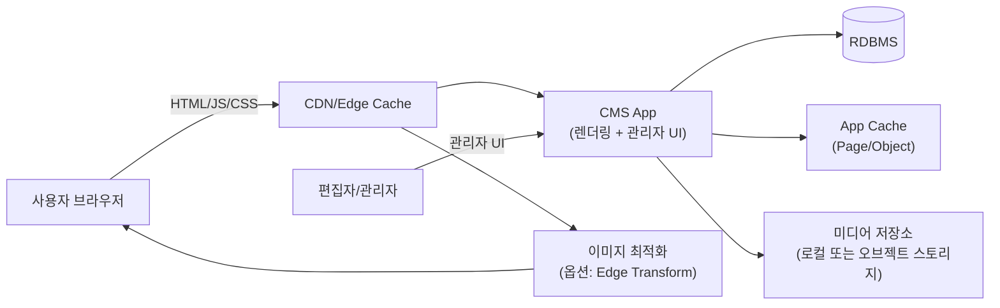
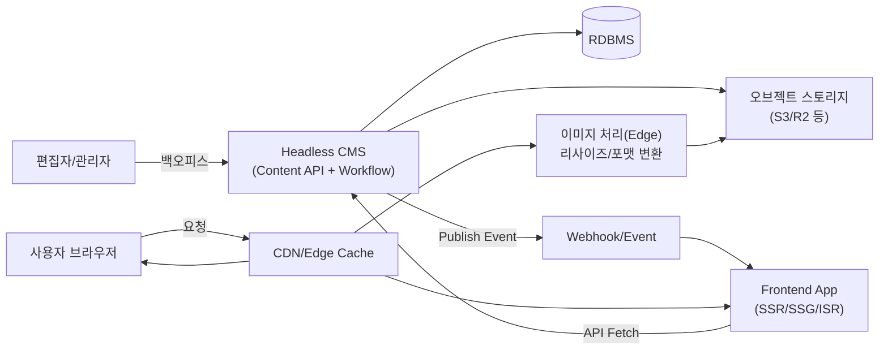
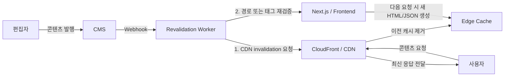
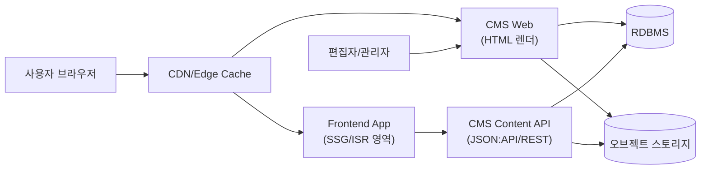
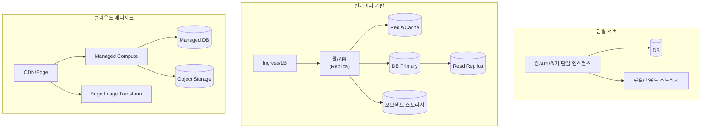
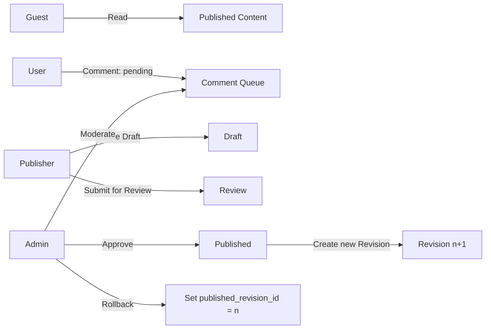
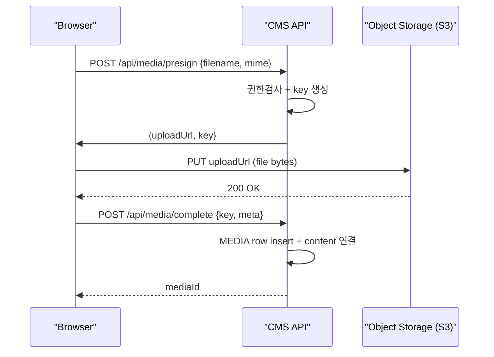

# CMS 구현 실무 아키텍처와 구현 예제

## Executive Summary

**콘텐츠 모델·버전·권한·워크플로·캐시·미디어 파이프라인**을 함께 설계하는 아키텍처를 소개합니다.  

### 먼저 보는 한 줄 요약

- **CMS**: 글, 이미지, 댓글 같은 콘텐츠를 저장하고 관리하는 시스템입니다.
- **모놀리식 CMS**: 콘텐츠 관리와 프레젠테이션(HTML 생성)을 한 프로그램이 같이 처리합니다.
- **헤드리스 CMS**: 콘텐츠(데이터)는 API를 통해 관리하고, 프레젠테이션(HTML 생성)은 별도 프런트엔드가 구현합니다.
- **하이브리드 CMS**: 어떤 화면은 CMS가 직접 만들고, 어떤 화면은 별도 프런트엔드가 만듭니다.
- **캐시(Cache)**: 자주 쓰는 결과를 잠깐 저장해 두었다가 더 빠르게 보여주는 장치입니다.
- **CDN**: 사용자와 가까운 서버에서 정적 파일이나 페이지를 대신 전달해 주는 네트워크입니다.
- **리비전(Revision)**: 글의 예전 버전을 저장해 두는 기록입니다.
- **RBAC**: 사용자 역할(admin, author 등)에 따라 권한을 주는 방식입니다.

처음 읽는다면 “CMS는 글을 저장하는 DB 프로그램”이라고 생각하기 쉽습니다. 하지만 실제 서비스에서는 **누가 수정할 수 있는지**, **언제 배포되는지**, **배포 후 화면이 언제 갱신되는지**, **이전 버전으로 되돌릴 수 있는지**까지 함께 설계해야 합니다. 이 문서는 바로 그 큰 그림을 이해하는 데 목적이 있습니다.  

실무에서는 모놀리식(결합형)·헤드리스(API 중심)·하이브리드(HTML+API 혼합) 중 어떤 패턴을 선택하더라도, **CDN/HTTP 캐시 정책과 발행 이벤트 기반 무효화**가 성능과 운영 난이도를 좌우합니다. 이 기준은 [RFC 9111](https://datatracker.ietf.org/doc/html/rfc9111), [Contentful Webhooks 문서](https://www.contentful.com/developers/docs/concepts/webhooks/), [Next.js `revalidateTag` 문서](https://nextjs.org/docs/app/api-reference/functions/revalidateTag)에서 직접 확인할 수 있습니다.  

또한 **역할 기반 권한(RBAC)과 감사로그(AuditLog), 리비전(Revision)·롤백**은 단순 기능이 아니라 운영 통제의 핵심입니다. 따라서 데이터 모델 단계에서부터 포함해 두어야 합니다. 역할·권한 구성은 [WordPress Roles and Capabilities](https://developer.wordpress.org/plugins/users/roles-and-capabilities/)가, XSS와 같은 운영 리스크는 [OWASP XSS Prevention Cheat Sheet](https://cheatsheetseries.owasp.org/cheatsheets/Cross_Site_Scripting_Prevention_Cheat_Sheet.html)가 좋은 기준을 제공합니다.  

이 문서는 실무자가 바로 가져다 쓸 수 있도록 각 패턴의 구성요소와 데이터 흐름, 간소화 ERD, 권한·워크플로, 보안·운영 체크리스트, 최소 실행 예제 코드, 배포 샘플(Docker Compose/Kubernetes)까지 한 번에 설명합니다. 배포 예시는 [Docker Compose application model](https://docs.docker.com/compose/intro/compose-application-model/)과 [Kubernetes HPA 문서](https://kubernetes.io/docs/concepts/workloads/autoscaling/horizontal-pod-autoscale/)를 기준으로 정리했습니다.  
CMS를 콘텐츠 관리 계층과 프레젠테이션 계층의 분리 관점에서 설명하는 예시: [Drupal Decoupled Drupal 가이드](https://www.drupal.org/docs/develop/decoupled-drupal)

### 이 문서의 전제

이 글은 **개념 전달용 baseline**을 설명하는 문서입니다. 따라서 예시는 이해를 돕기 위해 다음 전제를 두고 단순화했습니다.  
- 단일 사이트
- 단일 언어
- 동시 편집 고려 안함
- 핵심 흐름 이해를 우선한 최소 모델

실무에 바로 적용할 때는 멀티사이트, 다국어, 다단계 승인, 비동기 이벤트 처리, 세분화된 권한 모델처럼 조직별 요구사항을 추가로 반영해야 합니다.  

## 아키텍처 패턴과 배포 토폴로지

아래 비교는 대표 구현에 가깝습니다. 실제 현장에서는 서비스 규모와 팀 역량에 따라 패턴을 섞어 쓰는 경우가 많습니다. 특히 Drupal은 백엔드를 콘텐츠 API로 쓰는 Decoupled/Headless 패턴을 공식 문서에서 설명하고 있으며, 이때 프런트엔드는 React·Vue·Astro 같은 별도 애플리케이션으로 분리하는 구성이 일반적입니다. 참고: [Drupal Decoupled Drupal](https://www.drupal.org/docs/develop/decoupled-drupal), [Drupal JSON:API module](https://www.drupal.org/docs/core-modules-and-themes/core-modules/jsonapi-module).  

### 패턴을 비유로 먼저 이해하기

- **모놀리식 CMS**: 한 식당이 주문, 요리, 서빙을 모두 직접 처리하는 구조입니다.
- **헤드리스 CMS**: 주방은 CMS가 맡고, 서빙은 별도 프런트엔드 앱이 맡는 구조입니다.
- **하이브리드 CMS**: 기본 메뉴는 식당이 직접 서빙하고, 일부 메뉴는 외부 파트너가 서빙하는 구조입니다.
- **Self-hosted Embed**: 원래 외부 서비스에 맡길 기능을 우리 팀이 직접 설치해 운영하는 구조입니다.

입문자라면 표를 보기 전에 이 비유를 먼저 잡고 가는 편이 훨씬 이해하기 쉽습니다.  

### 패턴 비교 표

| 항목 | 모놀리식 CMS | 헤드리스 CMS | 하이브리드 CMS | Self-hosted “Embed” (설치형 기능 위임) |
|---|---|---|---|---|
| 프레젠테이션(HTML 생성) | CMS가 직접 HTML 생성(템플릿) | 별도 프런트앱이 HTML 생성(SSR/SSG/ISR) | 일부는 CMS, 일부는 프런트앱이 생성 | 각 기능을 내부 서비스로 제공(댓글/검색/분석 등) |
| 핵심 장점 | 구축/운영 단순, 편집 경험(백오피스) 일체형 | 채널 확장(웹/앱), 프런트 자유도 | 점진적 분리(리스크 분산) | 벤더 JS/SDK 의존 ↓, 데이터 통제 ↑ |
| 핵심 단점 | 프런트 기술 선택 제약, 대규모 커스터마이징 시 복잡도 증가 | 캐시 무효화/배포 파이프라인 복잡 | 경계가 모호하면 운영 난이도 상승 | 설치·업그레이드·관측·보안 책임이 팀에 귀속 |
| 캐시/CDN 포인트 | HTML/정적 자산 CDN, 앱 내부 캐시 | API 캐시 + 프런트 캐시(ISR/Edge) | 경로별 캐시 전략 분리 | 기능별 캐시/스토리지/큐 운영 필요 |
| 기술적 특징 | 콘텐츠 관리와 프레젠테이션이 한 앱에 결합 | 콘텐츠 관리는 API 중심, 프레젠테이션은 별도 앱에서 구현 | 동일 CMS가 HTML과 API를 함께 제공 | 댓글/검색/분석 같은 기능을 내부 서비스로 위임 |

Decoupled/Headless 정의와 JSON:API 사용은 [Drupal Decoupled Drupal](https://www.drupal.org/docs/develop/decoupled-drupal)과 [Drupal JSON:API module](https://www.drupal.org/docs/core-modules-and-themes/core-modules/jsonapi-module)에서 직접 설명합니다.  
또한 3rd-party 스크립트는 공급망과 무결성 리스크가 핵심이므로, [OWASP Third Party JavaScript Management Cheat Sheet](https://cheatsheetseries.owasp.org/cheatsheets/Third_Party_Javascript_Management_Cheat_Sheet.html)와 [OWASP Content Security Policy Cheat Sheet](https://cheatsheetseries.owasp.org/cheatsheets/Content_Security_Policy_Cheat_Sheet.html)를 함께 보는 것이 좋습니다.  

### 모놀리식 패턴 다이어그램



모놀리식은 하나의 애플리케이션이 HTML까지 생성하므로, 성능은 주로 **페이지 캐시·오브젝트 캐시·CDN 정적 캐싱** 설계에 의해 결정됩니다. 이때 기준이 되는 캐시 모델은 [RFC 9111](https://datatracker.ietf.org/doc/html/rfc9111)입니다.  

쉽게 말해, 모놀리식은 “콘텐츠 관리도 CMS가 하고, 프레젠테이션(HTML 생성)도 CMS가 한다”는 뜻입니다. 워드프레스 블로그를 떠올리면 이해하기 쉽습니다.  

이 그림에서 꼭 봐야 할 것 3가지  
- 편집자와 사용자가 결국 같은 CMS 앱을 바라본다는 점
- CMS 앱이 DB, 캐시, 미디어 저장소를 한 번에 다룬다는 점
- 성능 문제가 생기면 캐시와 CDN 설계가 먼저 중요해진다는 점

### 헤드리스 패턴 다이어그램



헤드리스에서는 “발행 이벤트 → 캐시 무효화/재생성”이 운영의 핵심입니다. [Contentful Webhooks](https://www.contentful.com/developers/docs/concepts/webhooks/)는 웹훅을 외부 시스템이 데이터 변경에 반응하도록 하는 HTTP 콜백으로 설명하고, [Contentful FAQ](https://www.contentful.com/help/faq/webhooks/)는 publish 이후 CDN 계층이 purge된다고 안내합니다.  
프런트가 Next.js라면 ISR(Incremental Static Regeneration)과 on-demand revalidation을 함께 설계하는 편이 좋습니다. 구체적인 동작은 [Next.js ISR](https://nextjs.org/docs/13/pages/building-your-application/rendering/incremental-static-regeneration)과 [Next.js `revalidateTag`](https://nextjs.org/docs/app/api-reference/functions/revalidateTag) 문서를 참고하면 됩니다.  

쉽게 말해, 헤드리스는 “콘텐츠(데이터)는 CMS가 API로 관리하고, 프레젠테이션(HTML 생성)은 다른 앱이 맡는 구조”입니다. 그래서 화면을 빠르게 보여주려면 캐시를 잘 써야 하고, 글이 바뀌면 그 캐시를 다시 갱신하는 흐름이 중요해집니다.  

이 그림에서 꼭 봐야 할 것 3가지  
- 콘텐츠 관리와 프레젠테이션이 분리되어 있다는 점
- 프런트엔드 앱이 CMS API를 호출해 화면을 만든다는 점
- 글 발행 후에는 웹훅과 캐시 갱신 흐름이 꼭 따라온다는 점

### 발행 이벤트와 캐시 무효화/재생성 흐름

이 부분은 실무에서 자주 오해하는 지점이라 조금 더 짚고 가겠습니다.  
CloudFront 같은 CDN은 엣지에 정적 응답을 오래 보관해 응답 속도를 높입니다. 문제는 CMS에서 글을 발행해도, 엣지에 남아 있는 이전 HTML·JSON·이미지 메타데이터가 계속 응답될 수 있다는 점입니다. 그래서 발행 직후에는 **어떤 캐시를 버릴지(invalidation)**, 그리고 **어떤 페이지를 다시 만들지(regeneration/revalidation)**를 함께 설계해야 합니다. 관련 개념은 [CloudFront private content](https://docs.aws.amazon.com/en_us/AmazonCloudFront/latest/DeveloperGuide/PrivateContent.html), [Contentful FAQ](https://www.contentful.com/help/faq/webhooks/), [Next.js `revalidateTag`](https://nextjs.org/docs/app/api-reference/functions/revalidateTag)에서 확인할 수 있습니다.  

먼저 용어를 아주 단순하게 정리하면 다음과 같습니다.  
- **캐시 무효화(invalidation)**: 저장된 옛날 결과를 “버리는 것”
- **재생성(regeneration)**: 최신 데이터로 페이지를 “다시 만드는 것”
- **재검증(revalidation)**: 다음 요청이 왔을 때 “지금 캐시가 아직 유효한지 다시 확인하는 것”

학부생 입장에서는 “글을 고쳤는데 왜 바로 화면이 안 바뀌지?”라는 질문이 핵심입니다. 답은 보통 캐시에 있습니다. 서버가 아니라 CDN이나 프런트엔드가 예전 결과를 들고 있으면, DB를 고쳐도 화면은 바로 안 바뀔 수 있습니다.  



정리하면 다음과 같습니다.  
- CDN invalidation만 하면, 오래된 정적 파일은 비울 수 있지만 다음 요청 시 원본 서버가 새 결과를 다시 만들어야 합니다.  
- Next.js 재검증만 하면, 애플리케이션 내부 캐시는 갱신되더라도 외부 CDN이 오래된 응답을 들고 있으면 사용자는 예전 화면을 볼 수 있습니다.  
- 따라서 CloudFront를 앞단에 두는 구조에서는 `발행 이벤트 → CDN invalidation → 애플리케이션 재검증` 순서를 같이 설계하는 편이 안전합니다.  

> 여기서는 설명을 단순하게 하기 위해 상세 페이지 중심으로 invalidation/revalidation을 설명했습니다. 실무에서는 목록 페이지, 홈, 태그/카테고리, 검색 인덱스, 추천 영역, RSS, 이미지 파생본까지 함께 영향을 받는지 의존성 지도를 먼저 그려야 합니다.

이 그림에서 꼭 봐야 할 것 3가지  
- “글 발행”이 끝이 아니라 그 뒤에 캐시 갱신 작업이 이어진다는 점
- CDN 캐시 제거와 프런트엔드 재검증이 서로 다른 작업이라는 점
- 사용자는 이 과정을 직접 보지 않지만, 결과적으로 최신 화면을 받게 된다는 점

### 하이브리드 패턴 다이어그램



하이브리드는 한 CMS가 HTML과 API를 동시에 제공하는 형태입니다. 점진적으로 분리해야 하는 조직에서는 이 패턴이 가장 현실적인 출발점이 되는 경우가 많습니다. Drupal도 [Decoupled Drupal](https://www.drupal.org/docs/develop/decoupled-drupal)과 [JSON:API module](https://www.drupal.org/docs/core-modules-and-themes/core-modules/jsonapi-module)을 통해 이런 접근을 공식적으로 설명합니다.  

쉽게 말해, 하이브리드는 “모놀리식과 헤드리스의 중간 단계”입니다. 어떤 페이지의 프레젠테이션은 CMS가 만들고, 어떤 페이지는 별도 프런트엔드가 만들도록 나누고 싶을 때 자주 선택합니다.  

이 그림에서 꼭 봐야 할 것 3가지  
- 한 CMS가 HTML과 API를 모두 제공할 수 있다는 점
- 사용자 요청이 어떤 경우에는 CMS로, 어떤 경우에는 프런트엔드 앱으로 갈 수 있다는 점
- 기존 시스템을 한 번에 버리지 않고 점진적으로 전환할 수 있다는 점

### 배포 토폴로지와 CDN/캐시/이미지/미디어 연계



- **미디어 업로드/전달**: 오브젝트 스토리지(예: S3)는 presigned URL로 “클라이언트에게 AWS 자격 증명을 주지 않고도 제한된 업로드 권한”을 줄 수 있습니다. 참고: [AWS S3 presigned URLs](https://docs.aws.amazon.com/boto3/latest/guide/s3-presigned-urls.html).  
- **프라이빗 미디어 제공**: CloudFront는 signed URL로 프라이빗 콘텐츠 접근을 제어하는 구성을 공식 문서에서 설명합니다. 참고: [CloudFront signed URLs](https://docs.aws.amazon.com/AmazonCloudFront/latest/DeveloperGuide/private-content-signed-urls.html).  
- **이미지 처리(Edge)**: Cloudflare는 이미지 변환과 이미지 브라우저 TTL을 별도 문서로 안내합니다. 참고: [Cloudflare Transform Images](https://developers.cloudflare.com/images/transform-images/), [Cloudflare Browser TTL](https://developers.cloudflare.com/images/manage-images/browser-ttl/).  
- **HTTP 캐시 제어의 기준**: HTTP 캐시와 `Cache-Control`의 표준 의미는 [RFC 9111](https://datatracker.ietf.org/doc/html/rfc9111)이 정의합니다.  

이 그림에서 꼭 봐야 할 것 3가지  
- 배포 방식은 달라도 DB, 스토리지, 캐시 같은 핵심 요소는 반복해서 등장한다는 점
- 단일 서버에서 시작해도 나중에는 컨테이너나 매니지드 환경으로 확장될 수 있다는 점
- CDN, 이미지 처리, 오브젝트 스토리지는 CMS와 따로 분리되는 경우가 많다는 점

### 장별 Q&A

- **Q. 모놀리식, 헤드리스, 하이브리드 중 무엇이 가장 좋은가요?**  
  A. 항상 하나가 정답인 것은 아닙니다. 작은 팀이 빠르게 시작하려면 모놀리식이 편할 수 있고, 여러 채널에 콘텐츠를 보내야 하면 헤드리스가 유리할 수 있습니다. 하이브리드는 그 중간에서 점진적으로 전환할 때 자주 선택합니다.
- **Q. 다이어그램이 많아서 복잡한데, 처음엔 무엇부터 보면 될까요?**  
  A. 먼저 “사용자 요청이 어디로 가는지”, “콘텐츠를 누가 관리하는지”, “캐시가 어디에 있는지” 세 가지만 따라가면 됩니다.
- **Q. CDN은 꼭 필요한가요?**  
  A. 작은 실습에서는 없어도 되지만, 실제 서비스에서는 성능과 트래픽 절감을 위해 거의 항상 고려합니다.

## 데이터 모델과 ERD

CMS 실무 데이터 모델은 “콘텐츠”만이 아니라 **권한·리비전·감사로그·댓글(및 모더레이션)**까지 포함해야 합니다. 특히 [WordPress Roles and Capabilities](https://developer.wordpress.org/plugins/users/roles-and-capabilities/)는 역할(Role)과 수행 가능한 작업(Capabilities)을 분리해 설명하고 있어, CMS 권한 설계의 좋은 출발점이 됩니다.  

### ERD를 읽기 전에

ERD(Entity Relationship Diagram)는 “데이터베이스 테이블들이 어떻게 연결되는지”를 그림처럼 보여주는 도구입니다.  
- **PK(Primary Key)**: 각 행을 구별하는 고유 ID
- **FK(Foreign Key)**: 다른 테이블의 ID를 가리키는 값
- **1:N 관계**: 한 사용자가 여러 글을 쓸 수 있는 것처럼, 한쪽이 여러 개와 연결되는 관계

ERD를 처음 볼 때는 모든 테이블을 한 번에 이해하려 하지 말고, 먼저 `USER`, `CONTENT`, `REVISION`, `COMMENT` 네 개만 따라가면 됩니다.  

### 간소화 ERD (요구 엔티티 포함)

```mermaid
erDiagram
  USER ||--o{ CONTENT : "creates"
  USER ||--o{ REVISION : "authors"
  USER ||--o{ COMMENT : "writes"
  USER ||--o{ AUDIT_LOG : "acts"

  ROLE ||--o{ USER_ROLE : "assigned"
  USER ||--o{ USER_ROLE : "has"
  ROLE ||--o{ ROLE_PERMISSION : "grants"
  PERMISSION ||--o{ ROLE_PERMISSION : "in"

  CONTENT ||--o{ REVISION : "versions"
  CONTENT ||--o{ CONTENT_TAXONOMY : "tagged"
  TAXONOMY ||--o{ CONTENT_TAXONOMY : "applies"

  CONTENT ||--o{ COMMENT : "has"
  MEDIA ||--o{ CONTENT_MEDIA : "linked"
  CONTENT ||--o{ CONTENT_MEDIA : "embeds"

  USER {
    uuid id PK
    string email UNIQUE
    string password_hash
    string display_name
    string status "active|disabled"
    timestamptz created_at
    timestamptz last_login_at
  }

  ROLE {
    uuid id PK
    string name "guest|user|publisher|admin"
    string description
  }

  PERMISSION {
    uuid id PK
    string resource "content|media|comment|user"
    string action "create|read|update|delete|publish|rollback|moderate"
    string scope "own|any"
  }

  USER_ROLE {
    uuid user_id FK
    uuid role_id FK
    timestamptz assigned_at
  }

  ROLE_PERMISSION {
    uuid role_id FK
    uuid permission_id FK
  }

  CONTENT {
    uuid id PK
    string type "Article|Page|Block"
    string slug UNIQUE
    string title
    text body
    string status "draft|review|published|archived"
    uuid author_id FK
    uuid published_revision_id FK
    timestamptz published_at
    timestamptz created_at
    timestamptz updated_at
  }

  REVISION {
    uuid id PK
    uuid content_id FK
    int revision_no
    uuid editor_id FK
    jsonb snapshot
    string change_note
    timestamptz created_at
  }

  MEDIA {
    uuid id PK
    string kind "image|video|file"
    string storage_key
    string mime_type
    int size_bytes
    int width
    int height
    string checksum
    timestamptz created_at
  }

  TAXONOMY {
    uuid id PK
    string type "tag|category"
    string name
    string slug
    uuid parent_id "nullable"
  }

  CONTENT_TAXONOMY {
    uuid content_id FK
    uuid taxonomy_id FK
  }

  CONTENT_MEDIA {
    uuid content_id FK
    uuid media_id FK
    string usage "hero|inline|gallery"
    int sort_order
  }

  COMMENT {
    uuid id PK
    uuid content_id FK
    uuid author_id FK "nullable for guest"
    text body
    string status "pending|approved|rejected|spam"
    string ip_hash
    timestamptz created_at
  }

  AUDIT_LOG {
    uuid id PK
    uuid actor_id FK
    string action
    string resource_type
    uuid resource_id
    jsonb meta
    timestamptz created_at
  }
```

설계 포인트는 다음과 같습니다.  
- **Revision.snapshot**을 `jsonb`로 두면 현재 스키마와 과거 스냅샷의 차이를 흡수하기 쉽고, 롤백도 트랜잭션으로 처리하기 편합니다.  
- Taxonomy는 `tag`와 `category`를 분리하고, `category`는 `parent_id`로 트리를 만들 수 있게 두는 편이 일반적입니다. 다만 트리가 깊어질수록 조회 쿼리와 캐시 전략을 함께 설계해야 합니다.  

위 문장을 더 쉽게 풀면 다음과 같습니다.  
- **Revision.snapshot**: “예전 글 내용을 통째로 저장해 둔 복사본”이라고 생각하면 됩니다.
- **jsonb**: JSON 데이터를 DB에 저장하는 방식입니다. 여기서는 “예전 버전 전체를 저장하기 편해서” 사용합니다.
- **Taxonomy**: 태그(tag), 카테고리(category)처럼 글을 분류하는 기준입니다.

> 설명용 단순화를 위해 이 ERD는 `published revision`과 `working draft`를 별도 엔터티로 분리하지 않았습니다. 실무에서는 발행본과 편집 중 초안을 동시에 안전하게 운영하기 위해 `published_revision_id`와 `draft_revision_id`를 분리하거나, 아예 draft/published 저장 구조를 나누는 경우가 많습니다.

이 그림에서 꼭 봐야 할 것 3가지  
- `USER`가 글, 댓글, 감사로그 같은 여러 데이터와 연결된다는 점
- `CONTENT` 하나만 보는 것이 아니라 리비전, 태그, 미디어까지 함께 관리해야 한다는 점
- CMS DB는 “글 저장소”라기보다 “운영 기록까지 담는 구조”에 가깝다는 점

### 장별 Q&A

- **Q. 왜 글 테이블 하나만 두면 안 되나요?**  
  A. 처음에는 가능해 보이지만, 실제로는 댓글, 권한, 이전 버전, 미디어 연결 같은 정보가 함께 필요해져서 결국 테이블이 나뉘게 됩니다.
- **Q. 리비전은 왜 필요한가요?**  
  A. 누가 언제 무엇을 바꿨는지 추적하고, 문제가 생겼을 때 이전 상태로 되돌리기 위해 필요합니다.
- **Q. ERD를 볼 때 모든 테이블을 다 외워야 하나요?**  
  A. 그럴 필요는 없습니다. 먼저 `USER`, `CONTENT`, `REVISION`, `COMMENT`의 연결만 이해해도 전체 구조가 훨씬 잘 보입니다.

## 권한 모델과 워크플로

권한 모델은 역할(Role)과 행위(Capability/Permission)를 분리해 조합하는 방식이 관리하기 쉽습니다. WordPress도 같은 방식을 설명하며, 기본 역할에 capability가 할당되지만 `add_cap`·`remove_cap`으로 조정할 수 있다고 안내합니다. 참고: [WordPress Roles and Capabilities](https://developer.wordpress.org/plugins/users/roles-and-capabilities/).  

입문자 관점에서는 이렇게 이해하면 충분합니다.  
- **Role**: “이 사람은 누구인가?” 예: 관리자, 작성자, 일반 사용자
- **Permission**: “이 사람이 무엇을 할 수 있는가?” 예: 글 작성, 발행, 삭제
- **RBAC**: 역할에 따라 권한을 묶어서 주는 방식
- **ABAC**: 역할뿐 아니라 글 종류, 언어, 소속 사이트 같은 속성까지 보고 판단하는 방식

### 역할·권한 매트릭스 (예시)

| 리소스/행위 | guest | user | author/publisher | admin |
|---|---:|---:|---:|---:|
| Content 읽기(공개) | ✅ | ✅ | ✅ | ✅ |
| Content 생성(draft) | ❌ | ❌/✅(옵션) | ✅(own) | ✅(any) |
| Content 수정 | ❌ | ❌ | ✅(own) | ✅(any) |
| Content 발행(publish) | ❌ | ❌ | ✅ | ✅ |
| Content 롤백(과거 리비전) | ❌ | ❌ | ✅(own/권한부여) | ✅ |
| Media 업로드 | ❌ | ❌/✅(옵션) | ✅ | ✅ |
| Comment 작성 | ✅(익명) | ✅ | ✅ | ✅ |
| Comment 승인/삭제(moderate) | ❌ | ❌ | ✅(권한부여) | ✅ |
| User/Role 관리 | ❌ | ❌ | ❌ | ✅ |
| AuditLog 조회 | ❌ | ❌ | ✅(제한) | ✅ |

권한을 세분화할수록 운영 안정성은 올라가지만, 관리 복잡도도 함께 증가합니다. 그래서 초기에는 `own/any` 정도로만 단순하게 시작하고, 실제 운영 이슈가 생길 때 확장하는 편이 좋습니다.  

> 이 표는 개념 설명용 최소 RBAC 예시입니다. 실무에서는 `site`, `locale`, `workflow stage`, `content type`, `tenant` 같은 조건이 추가되어 ABAC에 가까운 형태로 확장되는 경우가 많습니다.

### 워크플로우 플로우

아래는 흔한 “Draft → Review → Publish → Rollback” 흐름입니다.



- 댓글이나 리뷰 같은 승인 큐는 XSS와 스팸 리스크를 낮추는 실무적 장치입니다. 참고: [OWASP XSS Prevention Cheat Sheet](https://cheatsheetseries.owasp.org/cheatsheets/Cross_Site_Scripting_Prevention_Cheat_Sheet.html).  
- 롤백은 현재 콘텐츠를 과거 `snapshot`으로 되돌리고 `published_revision_id`를 갱신하는 작업이므로, 트랜잭션과 감사로그를 함께 남기는 편이 안전합니다.  

이 그림에서 꼭 봐야 할 것 3가지  
- 글은 보통 바로 공개되지 않고 초안, 검토, 발행 단계를 거친다는 점
- 댓글도 바로 노출되지 않고 승인 큐를 거칠 수 있다는 점
- 발행 후에도 필요하면 이전 버전으로 되돌릴 수 있다는 점

### 장별 Q&A

- **Q. 왜 권한을 세분화하나요?**  
  A. 모든 사람에게 관리자 권한을 주면 편해 보이지만, 실수나 보안 문제의 위험이 커집니다. 그래서 역할별로 할 수 있는 일을 나누어 두는 것입니다.
- **Q. 워크플로우는 왜 필요한가요?**  
  A. 글을 쓰는 사람과 승인하는 사람이 다를 수 있기 때문입니다. 워크플로우는 “작성 → 검토 → 발행” 과정을 일정하게 관리하는 장치입니다.
- **Q. 롤백은 삭제와 같은 뜻인가요?**  
  A. 아닙니다. 롤백은 현재 상태를 지우는 것이 아니라, 과거에 저장해 둔 정상 상태로 되돌리는 것입니다.

### API 인증·세션·JWT·OAuth 고려사항

- **세션 쿠키 기반(웹 중심)**: CSRF 방어가 중요합니다. 참고: [OWASP CSRF Prevention Cheat Sheet](https://cheatsheetseries.owasp.org/cheatsheets/Cross-Site_Request_Forgery_Prevention_Cheat_Sheet.html).  
- **JWT 기반(모바일/서드파티 클라이언트 포함)**: JWT는 클레임을 전달하기 위한 compact, URL-safe 형식입니다. 참고: [RFC 7519](https://datatracker.ietf.org/doc/html/rfc7519).  
- **OAuth 2.0(외부 앱/연동)**: 제3자 애플리케이션이 제한된 접근 권한을 얻도록 하는 인가 프레임워크입니다. 참고: [RFC 6749](https://datatracker.ietf.org/doc/html/rfc6749).  
- **실무 결론**: 관리자·편집자 UI는 세션 + CSRF 토큰, 공개 API·모바일은 OAuth 2.0 또는 짧은 만료 시간을 가진 JWT를 함께 쓰는 패턴이 가장 흔합니다.  

## 보안과 운영 체크리스트

CMS는 사용자 입력(댓글·에디터 HTML), 권한(관리자 기능), 서드파티 스크립트(위젯·분석), 미디어 업로드(파일) 등 공격 표면이 넓습니다. XSS와 CSRF의 정의와 영향은 [OWASP XSS Cheat Sheet](https://cheatsheetseries.owasp.org/cheatsheets/Cross_Site_Scripting_Prevention_Cheat_Sheet.html), [OWASP CSRF Cheat Sheet](https://cheatsheetseries.owasp.org/cheatsheets/Cross-Site_Request_Forgery_Prevention_Cheat_Sheet.html), [MDN CSP 소개](https://developer.mozilla.org/en-US/docs/Security/CSP/Introducing_Content_Security_Policy)에서 반복적으로 강조됩니다.  

### 보안 용어를 먼저 쉽게 풀면

- **XSS**: 사용자가 입력한 악성 스크립트가 다른 사용자 브라우저에서 실행되는 문제
- **CSRF**: 로그인된 사용자가 원하지 않는 요청을 보내게 만드는 문제
- **CSP**: 어떤 스크립트를 실행해도 되는지 브라우저에 규칙을 주는 장치
- **SRI**: 외부 파일이 원래 파일과 같은지 해시로 확인하는 장치

보안 체크리스트는 외워야 하는 목록이 아니라, “입력값이 위험한가?”, “권한이 너무 넓지 않은가?”, “외부 스크립트를 믿어도 되는가?”를 점검하는 질문표라고 생각하면 됩니다.  

### 운영 체크리스트 표

| 영역 | 체크 항목 | 실무 포인트 | 주요 근거 |
|---|---|---|---|
| 인증(Authentication) | 비밀번호 해시/정책, MFA(옵션), 로그인 시도 제한 | 관리자 계정 보호가 최우선 | [OWASP Authentication Cheat Sheet](https://cheatsheetseries.owasp.org/cheatsheets/Authentication_Cheat_Sheet.html) |
| 인가(Authorization) | RBAC, scope(own/any), 관리자 기능 분리 | Role과 Permission을 분리해 관리 | [WordPress Roles and Capabilities](https://developer.wordpress.org/plugins/users/roles-and-capabilities/) |
| CSRF | 상태 변경 요청에 CSRF 토큰/Origin 검사 | 쿠키 세션 모델에서 필수 | [OWASP CSRF Prevention Cheat Sheet](https://cheatsheetseries.owasp.org/cheatsheets/Cross-Site_Request_Forgery_Prevention_Cheat_Sheet.html) |
| XSS | 출력 인코딩/HTML Sanitization, 에디터 허용 태그 제한 | XSS는 계정 가장·데이터 탈취로 확대될 수 있음 | [OWASP XSS Prevention Cheat Sheet](https://cheatsheetseries.owasp.org/cheatsheets/Cross_Site_Scripting_Prevention_Cheat_Sheet.html) |
| CSP | `script-src`를 nonce/hash 기반으로 엄격화 | 인라인 차단 효과가 크고 nonce/hash를 우선 고려 | [MDN CSP 소개](https://developer.mozilla.org/en-US/docs/Security/CSP/Introducing_Content_Security_Policy), [OWASP CSP Cheat Sheet](https://cheatsheetseries.owasp.org/cheatsheets/Content_Security_Policy_Cheat_Sheet.html) |
| SRI | 외부 스크립트에 `integrity` 적용 | 3rd-party 파일 변조 방어 | [MDN Subresource Integrity](https://developer.mozilla.org/en-US/docs/Web/Security/Subresource_Integrity) |
| 서드파티 스크립트 | 도입 목록/버전 고정/변경 모니터링 | 도입보다 통제가 더 중요 | [OWASP Third Party JavaScript Management Cheat Sheet](https://cheatsheetseries.owasp.org/cheatsheets/Third_Party_Javascript_Management_Cheat_Sheet.html) |
| 비밀관리 | DB/토큰 키를 Secret Manager로 분리, 로테이션 | 코드와 이미지에 비밀 포함 금지 | [OWASP Secrets Management Cheat Sheet](https://cheatsheetseries.owasp.org/cheatsheets/Secrets_Management_Cheat_Sheet.html) |
| 백업/복구 | DB PITR, 오브젝트 스토리지 버저닝(옵션) | RTO/RPO 목표부터 문서화 | 실무 운영 정책 |
| 업그레이드 | 스키마 마이그레이션, 리비전/백업 후 배포 | 배포 전에 롤백 경로를 먼저 확보 | 실무 운영 정책 |
| 모니터링/로그 | 감사로그(AuditLog), 요청 로그, 알림 룰 | 발행·롤백·권한 변경은 반드시 감사로그 | 실무 운영 정책 |
| 침해대응 | 토큰 폐기/세션 강제 로그아웃, 키 로테이션 | 대응 속도는 로그 품질에 좌우 | [OWASP Incident Response Cheat Sheet](https://cheatsheetseries.owasp.org/cheatsheets/Incident_Response_Cheat_Sheet.html) |

CSP는 서드파티 JS가 침해되었을 때 악성 코드가 로드되는 상황에 대한 방어층을 제공합니다. OWASP는 strict CSP와 SRI를 함께 운영하는 접근을 권장합니다.  
MDN은 `script-src`에서 nonce/hash를 활용해 인라인 스크립트를 통제하는 방법을 자세히 설명합니다.  
또한 SRI는 CDN 등에서 받아오는 리소스가 조작되지 않았는지 해시로 검증하는 기능입니다.  

### 장별 Q&A

- **Q. XSS와 CSRF는 둘 다 웹 공격인데 무엇이 다른가요?**  
  A. XSS는 악성 스크립트가 브라우저에서 실행되는 문제이고, CSRF는 로그인된 사용자가 원하지 않는 요청을 보내게 만드는 문제입니다.
- **Q. CSP와 SRI는 왜 같이 이야기하나요?**  
  A. 둘 다 외부 스크립트를 더 안전하게 다루기 위한 장치이기 때문입니다. CSP는 “무엇을 실행해도 되는지”를 제한하고, SRI는 “받아온 파일이 변조되지 않았는지”를 확인합니다.
- **Q. 보안 체크리스트를 모두 외워야 하나요?**  
  A. 외우기보다, 새로운 기능을 만들 때 이 표를 보고 위험 요소를 점검하는 습관을 들이는 것이 더 중요합니다.

## 구현 예제 스니펫

아래 예제는 “최소 실행 가능”을 목표로 단순화했습니다. 에러 처리와 권한 검증은 핵심만 남겼고, 외부 시스템 연계는 웹훅과 캐시 무효화 흐름이 보이도록 구성했습니다.  

처음 읽는다면 코드를 한 줄씩 해석하려고 하기보다, “어떤 순간에 어떤 시스템이 움직이는가”만 따라가면 됩니다.  
- REST API 예시: 기능 목록을 보여줍니다.
- GraphQL 예시: 데이터를 어떤 모양으로 주고받는지 보여줍니다.
- SQL 예시: DB 테이블 구조를 보여줍니다.
- Node.js 예시: 글 발행 버튼을 눌렀을 때 서버가 무슨 일을 하는지 보여줍니다.

### REST API 설계 예시 (엔드포인트 중심)

- 공개 읽기
  - `GET /api/content?type=Article&tag=...&status=published`
  - `GET /api/content/:id`
- 작성/수정(인증 필요)
  - `POST /api/content` (draft 생성)
  - `PATCH /api/content/:id` (draft 수정)
  - `POST /api/content/:id/submit` (review 요청)
- 발행/롤백(권한 필요)
  - `POST /api/content/:id/publish`
  - `POST /api/content/:id/rollback` (body: `{ revisionId }`)
- 미디어
  - `POST /api/media/presign` (업로드용 presigned URL 발급)
  - `POST /api/media/complete` (메타데이터 확정)
- 댓글
  - `POST /api/content/:id/comments` (pending)
  - `POST /api/comments/:id/moderate` (approve/reject)

### GraphQL 스키마 예시 (간결)

```graphql
type Query {
  content(id: ID!): Content
  contents(type: ContentType, status: ContentStatus, tag: String, limit: Int = 20): [Content!]!
}

type Mutation {
  createDraft(input: DraftInput!): Content!
  updateDraft(id: ID!, input: DraftInput!): Content!
  submitForReview(id: ID!): Content!
  publish(id: ID!): PublishResult!
  rollback(id: ID!, revisionId: ID!): PublishResult!
}

enum ContentType { Article Page Block }
enum ContentStatus { draft review published archived }

type Content {
  id: ID!
  type: ContentType!
  slug: String!
  title: String!
  body: String!
  status: ContentStatus!
  authorId: ID!
  publishedAt: String
  tags: [Taxonomy!]!
  media: [Media!]!
  revisionNo: Int!
}

type PublishResult {
  contentId: ID!
  publishedRevisionId: ID!
  cacheInvalidationQueued: Boolean!
}
```

### DB 마이그레이션 예시(SQL) — 핵심 테이블만

```sql
-- content
create table content (
  id uuid primary key,
  type text not null check (type in ('Article','Page','Block')),
  slug text unique not null,
  title text not null,
  body text not null default '',
  status text not null check (status in ('draft','review','published','archived')),
  author_id uuid not null,
  published_revision_id uuid,
  published_at timestamptz,
  created_at timestamptz not null default now(),
  updated_at timestamptz not null default now()
);

-- revision
create table revision (
  id uuid primary key,
  content_id uuid not null references content(id) on delete cascade,
  revision_no int not null,
  editor_id uuid not null,
  snapshot jsonb not null,
  change_note text,
  created_at timestamptz not null default now(),
  unique(content_id, revision_no)
);

-- audit_log
create table audit_log (
  id uuid primary key,
  actor_id uuid not null,
  action text not null,
  resource_type text not null,
  resource_id uuid not null,
  meta jsonb,
  created_at timestamptz not null default now()
);
```

### 게시물 발행 트랜잭션 예시 (Node.js + Express + Postgres)

```js
import express from "express";
import { Pool } from "pg";
import crypto from "crypto";

const app = express();
app.use(express.json());

const pool = new Pool({ connectionString: process.env.DATABASE_URL });

// (간략) 인증/인가 미들웨어는 생략하고 actorId가 있다고 가정
app.post("/api/content/:id/publish", async (req, res) => {
  const contentId = req.params.id;
  const actorId = req.header("x-actor-id"); // 예시

  const client = await pool.connect();
  try {
    await client.query("begin");

    // 1) 현재 draft/review 상태의 콘텐츠 잠금
    const { rows: contentRows } = await client.query(
      "select * from content where id = $1 for update",
      [contentId]
    );
    if (contentRows.length === 0) throw new Error("content not found");
    const content = contentRows[0];

    if (!["draft", "review"].includes(content.status)) {
      throw new Error("invalid status to publish");
    }

    // 2) 새 revision 생성 (snapshot은 최소 예시)
    const revId = crypto.randomUUID();
    const { rows: revNoRows } = await client.query(
      "select coalesce(max(revision_no), 0) + 1 as next_no from revision where content_id = $1",
      [contentId]
    );
    const nextNo = Number(revNoRows[0].next_no);

    await client.query(
      "insert into revision(id, content_id, revision_no, editor_id, snapshot, change_note) values ($1,$2,$3,$4,$5,$6)",
      [
        revId,
        contentId,
        nextNo,
        actorId,
        JSON.stringify({
          title: content.title,
          body: content.body,
          slug: content.slug,
          type: content.type,
        }),
        "publish",
      ]
    );

    // 3) 콘텐츠를 published로 전환
    await client.query(
      "update content set status='published', published_revision_id=$1, published_at=now(), updated_at=now() where id=$2",
      [revId, contentId]
    );

    // 4) 감사로그 기록
    await client.query(
      "insert into audit_log(id, actor_id, action, resource_type, resource_id, meta) values ($1,$2,$3,$4,$5,$6)",
      [
        crypto.randomUUID(),
        actorId,
        "publish",
        "content",
        contentId,
        JSON.stringify({ publishedRevisionId: revId, revisionNo: nextNo }),
      ]
    );

    // 5) (권장) Outbox/Event 큐에 캐시 무효화 이벤트 적재 (여기선 meta로만 표시)
    await client.query(
      "insert into audit_log(id, actor_id, action, resource_type, resource_id, meta) values ($1,$2,$3,$4,$5,$6)",
      [
        crypto.randomUUID(),
        actorId,
        "enqueue_cache_invalidation",
        "content",
        contentId,
        JSON.stringify({ tags: ["content:" + contentId, "slug:" + content.slug] }),
      ]
    );

    await client.query("commit");
    res.json({ contentId, publishedRevisionId: revId, cacheInvalidationQueued: true });
  } catch (e) {
    await client.query("rollback");
    res.status(400).json({ error: String(e.message || e) });
  } finally {
    client.release();
  }
});

app.listen(3000, () => console.log("listening on :3000"));
```

발행 이벤트 기반 캐시 purge는 SaaS CMS에서도 핵심입니다. Contentful도 publish·unpublish 이후 CDN 계층 purge와 트래픽 급증 가능성을 별도로 안내합니다.  

### 이미지 업로드 흐름 (서버 → S3 presigned URL → 클라이언트 PUT)

AWS 문서는 presigned URL이 자격 증명을 직접 공유하지 않고도 제한된 업로드 권한을 부여하는 방식이라고 설명합니다. 참고: [AWS S3 presigned URLs](https://docs.aws.amazon.com/boto3/latest/guide/s3-presigned-urls.html).  



(옵션) 프라이빗 다운로드는 CloudFront signed URL로 제어할 수 있습니다. 참고: [CloudFront private content](https://docs.aws.amazon.com/AmazonCloudFront/latest/DeveloperGuide/private-content-overview.html).  

이 그림에서 꼭 봐야 할 것 3가지  
- 브라우저가 파일을 직접 API 서버에 올리지 않고 S3로 바로 올린다는 점
- API 서버는 파일 자체보다 “업로드 권한”과 “메타데이터 기록”을 담당한다는 점
- 큰 파일 업로드에서 서버 부하를 줄이기 위해 이런 구조를 자주 쓴다는 점

### 웹훅/이벤트 예시 (발행 시 캐시 무효화)

웹훅은 데이터 변경 시 외부 시스템이 반응하도록 연결하는 HTTP 콜백입니다. 참고: [Contentful Webhooks](https://www.contentful.com/developers/docs/concepts/webhooks/).  
Next.js는 ISR과 on-demand revalidation을 분리해 설명하며, 더 정밀한 갱신이 필요할 때는 `revalidateTag` 같은 API를 사용하도록 안내합니다. 참고: [Next.js ISR](https://nextjs.org/docs/13/pages/building-your-application/rendering/incremental-static-regeneration), [Next.js `revalidateTag`](https://nextjs.org/docs/app/api-reference/functions/revalidateTag).  

```js
// (예시) CMS publish webhook을 받아 Next.js 캐시 태그를 무효화하는 엔드포인트
import express from "express";

const app = express();
app.use(express.json());

app.post("/webhooks/publish", async (req, res) => {
  const { contentId, slug } = req.body;

  // 1) 서명 검증/리플레이 방지(권장) - 구현 미지정
  // 2) Next.js 재검증 호출 (예시는 내부 API 호출로 표현)
  await fetch(process.env.NEXT_REVALIDATE_URL, {
    method: "POST",
    headers: {
      "content-type": "application/json",
      "x-revalidate-secret": process.env.REVALIDATE_SECRET,
    },
    body: JSON.stringify({ tags: [`content:${contentId}`, `slug:${slug}`] }),
  });

  res.json({ ok: true });
});

app.listen(4000);
```

### 장별 Q&A

- **Q. REST API와 GraphQL 예시가 둘 다 필요한가요?**  
  A. 둘 중 하나만 써도 되지만, 이 문서에서는 “데이터를 주고받는 인터페이스를 어떻게 설계할 수 있는가”를 비교해서 보여주기 위해 둘 다 넣었습니다.
- **Q. SQL 예시는 왜 중요하나요?**  
  A. API가 아무리 좋아 보여도 결국 데이터가 어떤 구조로 저장되는지가 구현의 기준이 되기 때문입니다.
- **Q. 발행 코드 예제를 한 줄씩 이해해야 하나요?**  
  A. 처음에는 코드 문법보다 “발행 → 리비전 저장 → 감사로그 기록 → 캐시 무효화 준비”라는 순서를 이해하는 것이 더 중요합니다.

## 운영·확장성 전략과 장애 복구

### 캐시 전략

- **Edge CDN + Cache-Control**: HTTP 캐시의 동작과 제어 헤더는 [RFC 9111](https://datatracker.ietf.org/doc/html/rfc9111)이 정의합니다.  
- **ISR/SSG**: Next.js ISR은 정적 페이지를 전체 재빌드 없이 갱신할 수 있고, 더 정밀한 제어가 필요하면 on-demand revalidation을 적용합니다.  
- **Headless CMS CDN 특성**: Contentful처럼 CDN 레이어를 기본 제공하는 CMS는 publish 시점의 purge 정책과 API rate limit을 함께 봐야 합니다.  
- **이미지 캐시**: Cloudflare Images를 쓸 때는 이미지 변환 규칙과 브라우저 TTL을 별도로 설계해야 합니다.  
- **CSP/SRI로 서드파티 스크립트 통제**: 서드파티 호스트가 침해될 가능성을 전제로 CSP와 SRI를 함께 두는 편이 안전합니다.  

이 섹션도 개념 전달용으로 핵심 원칙만 남긴 버전입니다. 실제 설계에서는 캐시 키, 태그 체계, purge 우선순위, rate limit, warm-up 전략까지 함께 정해야 운영이 안정됩니다.  

입문자라면 여기서 모든 용어를 다 기억할 필요는 없습니다. 핵심은 “빠르게 보여주기 위해 캐시를 쓰면, 나중에는 최신 내용으로 바꾸는 규칙도 꼭 필요하다”는 점입니다.  

### DB 확장(리플리카/샤딩)과 파일 스토리지 확장

- **리플리카**: 읽기 트래픽이 많은 CMS는 `/content?status=published` 같은 공개 조회를 read replica로 분산하기 좋습니다. 다만 이 전략은 캐시 정책이 먼저 정리되어 있어야 효과가 큽니다.  
- **샤딩**: 멀티테넌트 CMS라면 `tenant_id` 기준 샤딩 또는 DB 분리를 검토할 수 있습니다. 이때 리비전·댓글·감사로그도 같은 기준으로 함께 이동할 수 있어야 합니다.  
- **스토리지**: 미디어는 DB보다 오브젝트 스토리지로 분리하는 편이 일반적이며, presigned URL 업로드가 운영과 보안 측면에서 가장 다루기 쉽습니다.  

### 장애 복구 RTO/RPO 권장값

요구사항이 주어지지 않았으므로, 아래 표의 “요구사항”은 **no specific constraint**로 표기합니다(당신의 서비스가 구체 목표를 정하면 갱신하세요). (요구사항 미지정)

- **RTO**: 장애가 났을 때 서비스를 다시 살리는 데 걸려도 되는 시간
- **RPO**: 장애가 났을 때 얼마나 최근 데이터까지는 꼭 복구되어야 하는지

| 구성요소 | 요구사항 RTO | 요구사항 RPO | 권장 예시(일반적 웹서비스) |
|---|---|---|---|
| 컨텐츠 DB | no specific constraint | no specific constraint | RTO 1–4h, RPO 5–15m |
| 미디어 스토리지 | no specific constraint | no specific constraint | RTO 1–4h, RPO 15–60m |
| 캐시/검색 인덱스 | no specific constraint | no specific constraint | RTO 수분–1h, RPO “재구축 가능” 기준 |

이 권장 예시는 정답이 아니라, 백업·복구 설계를 시작하기 위한 기준선입니다. 실제 값은 조직의 RTO/RPO 정책과 예산, 운영 인력 수준에 맞춰 조정하면 됩니다.  

### 장별 Q&A

- **Q. 캐시는 왜 빠르면서도 어려운가요?**  
  A. 캐시를 쓰면 응답은 빨라지지만, 대신 언제 최신 데이터로 바꿀지 규칙을 따로 정해야 하기 때문입니다.
- **Q. RTO와 RPO는 시험 용어처럼 보이는데 실무에서도 쓰나요?**  
  A. 네. 장애가 났을 때 얼마나 빨리 복구해야 하는지, 얼마만큼의 데이터 손실까지 허용할지를 정하는 매우 실무적인 기준입니다.
- **Q. 리플리카와 샤딩은 언제 필요한가요?**  
  A. 사용자가 많아져 DB 부하가 커질 때 검토합니다. 다만 너무 이른 시점에 적용하면 오히려 시스템이 복잡해질 수 있습니다.

## 마이그레이션·데이터 이관과 배포 샘플

### 데이터 export/import 포맷과 스키마 버전관리

- **포맷 선택**  
  - JSON: 콘텐츠 모델이 구조화되어 있고 관계를 보존해야 할 때 적합  
  - CSV: 단순 목록(태그, 카테고리)처럼 “평면 데이터”에 적합  
  - Markdown: Article 본문 중심(프런트가 MDX/Markdown 파이프라인일 때)  
- **스키마 버전관리**: 데이터 이관에서 가장 자주 실패하는 지점은 콘텐츠보다 스키마 불일치입니다. 그래서 실무에서는 스키마 마이그레이션을 코드로 버전관리하는 편이 안전합니다.  
- **내보내기/가져오기 자동화**: export/import를 수동으로 처리하기보다 CLI나 파이프라인으로 고정해 두면, 재현성과 롤백 가능성이 훨씬 좋아집니다.  
- **롤백 전략**:  
  1) 스키마 마이그레이션은 “전진만 가능한 변경”을 최소화(컬럼 추가→백필→NOT NULL 순서)  
  2) publish 전후 스냅샷(Revision) 유지 + published_revision_id로 즉시 롤백  
  3) 배포 실패 시 DB 롤백이 어려우면 “기능 플래그/라우팅 롤백”으로 우회(미지정)  

### Docker Compose 예시 (간결)

Docker Compose는 `services`, `networks`, `volumes`를 중심으로 애플리케이션 구성을 정의합니다. 참고: [Docker Compose application model](https://docs.docker.com/compose/intro/compose-application-model/).  

아래 예시는 개념 설명용 최소 배포입니다. 실제 운영 환경에서는 API 외에도 worker, queue, cache store, observability stack을 별도 컴포넌트로 두는 경우가 일반적입니다.  

쉽게 말해 Docker Compose는 “내 컴퓨터에서 여러 서버를 한 번에 실행하는 방법”입니다. 개발용 데모나 실습 환경을 빠르게 만들 때 자주 씁니다.  

```yaml
# docker-compose.yml
services:
  api:
    image: node:20-alpine
    working_dir: /app
    volumes: ["./app:/app"]
    command: sh -c "npm ci && node server.js"
    environment:
      DATABASE_URL: postgres://postgres:postgres@db:5432/cms
    ports: ["3000:3000"]
    depends_on: [db]

  db:
    image: postgres:16
    environment:
      POSTGRES_PASSWORD: postgres
      POSTGRES_DB: cms
    ports: ["5432:5432"]
    volumes: ["dbdata:/var/lib/postgresql/data"]

volumes:
  dbdata: {}
```

### Kubernetes 예시 (Deployment + Ingress + HPA)

Kubernetes의 HorizontalPodAutoscaler(HPA)는 Deployment 같은 워크로드의 replica 수를 자동으로 조정해 부하에 맞춥니다. 참고: [Kubernetes HPA](https://kubernetes.io/docs/concepts/workloads/autoscaling/horizontal-pod-autoscale/).  

이 예시도 핵심 리소스만 남긴 최소 구성입니다. 실무에서는 Ingress 외에 별도 worker Deployment, 메시지 큐, Secret 관리, PodDisruptionBudget, liveness/readiness probe, 로그 수집 구성을 함께 설계하는 편이 일반적입니다.  

쉽게 말해 Kubernetes는 “여러 서버 위에서 컨테이너를 자동으로 배치하고 관리하는 시스템”입니다.  
- **Deployment**: 앱 컨테이너를 몇 개 띄울지 정하는 설정
- **Ingress**: 외부 사용자의 요청을 어디로 보낼지 정하는 진입점
- **HPA**: 사용량이 많아지면 컨테이너 수를 자동으로 늘리는 기능

```yaml
apiVersion: apps/v1
kind: Deployment
metadata:
  name: cms-api
spec:
  replicas: 2
  selector:
    matchLabels: { app: cms-api }
  template:
    metadata:
      labels: { app: cms-api }
    spec:
      containers:
        - name: api
          image: your-registry/cms-api:latest
          ports: [{ containerPort: 3000 }]
          env:
            - name: DATABASE_URL
              valueFrom:
                secretKeyRef:
                  name: cms-secrets
                  key: database_url
          resources:
            requests: { cpu: "200m", memory: "256Mi" }
            limits: { cpu: "1000m", memory: "1Gi" }
---
apiVersion: networking.k8s.io/v1
kind: Ingress
metadata:
  name: cms-api
spec:
  rules:
    - host: cms.example.com
      http:
        paths:
          - path: /
            pathType: Prefix
            backend:
              service:
                name: cms-api
                port:
                  number: 80
---
apiVersion: autoscaling/v2
kind: HorizontalPodAutoscaler
metadata:
  name: cms-api
spec:
  scaleTargetRef:
    apiVersion: apps/v1
    kind: Deployment
    name: cms-api
  minReplicas: 2
  maxReplicas: 10
  metrics:
    - type: Resource
      resource:
        name: cpu
        target:
          type: Utilization
          averageUtilization: 70
```

### 장별 Q&A

- **Q. Docker Compose와 Kubernetes는 무엇이 다른가요?**  
  A. Docker Compose는 주로 로컬 개발이나 작은 데모 환경에서 편하고, Kubernetes는 여러 서버에 컨테이너를 배치하고 자동으로 운영하는 데 강합니다.
- **Q. 마이그레이션은 왜 조심해야 하나요?**  
  A. 데이터 구조를 바꾸는 작업이기 때문에, 잘못하면 기존 데이터가 깨지거나 서비스가 멈출 수 있습니다. 그래서 백업과 롤백 계획이 함께 필요합니다.
- **Q. 처음부터 Kubernetes를 써야 하나요?**  
  A. 꼭 그렇지는 않습니다. 학습이나 소규모 프로젝트라면 Docker Compose로도 충분하고, 규모가 커질 때 Kubernetes를 검토해도 늦지 않습니다.

### 출처 우선순위 가이드

실무에서 정책·보안·프로토콜은 표준과 1차 문서를 우선으로 보는 편이 가장 안전합니다. 이 문서도 같은 원칙으로 정리했습니다.  
- 표준/공식: [RFC 6749](https://datatracker.ietf.org/doc/html/rfc6749), [RFC 7519](https://datatracker.ietf.org/doc/html/rfc7519), [RFC 9111](https://datatracker.ietf.org/doc/html/rfc9111)
- 보안 가이드: [OWASP CSRF Cheat Sheet](https://cheatsheetseries.owasp.org/cheatsheets/Cross-Site_Request_Forgery_Prevention_Cheat_Sheet.html), [OWASP XSS Cheat Sheet](https://cheatsheetseries.owasp.org/cheatsheets/Cross_Site_Scripting_Prevention_Cheat_Sheet.html), [OWASP CSP Cheat Sheet](https://cheatsheetseries.owasp.org/cheatsheets/Content_Security_Policy_Cheat_Sheet.html), [OWASP Third Party JavaScript Management Cheat Sheet](https://cheatsheetseries.owasp.org/cheatsheets/Third_Party_Javascript_Management_Cheat_Sheet.html)
- 브라우저/웹 플랫폼: [MDN Introducing CSP](https://developer.mozilla.org/en-US/docs/Security/CSP/Introducing_Content_Security_Policy), [MDN Subresource Integrity](https://developer.mozilla.org/en-US/docs/Web/Security/Subresource_Integrity)
- 제품 문서: [WordPress Roles and Capabilities](https://developer.wordpress.org/plugins/users/roles-and-capabilities/), [Drupal Decoupled Drupal](https://www.drupal.org/docs/develop/decoupled-drupal), [Drupal JSON:API module](https://www.drupal.org/docs/core-modules-and-themes/core-modules/jsonapi-module), [Contentful Webhooks](https://www.contentful.com/developers/docs/concepts/webhooks/), [AWS S3 presigned URLs](https://docs.aws.amazon.com/boto3/latest/guide/s3-presigned-urls.html), [CloudFront private content](https://docs.aws.amazon.com/AmazonCloudFront/latest/DeveloperGuide/private-content-overview.html), [Cloudflare Transform Images](https://developers.cloudflare.com/images/transform-images/), [Cloudflare Browser TTL](https://developers.cloudflare.com/images/manage-images/browser-ttl/), [Next.js ISR](https://nextjs.org/docs/13/pages/building-your-application/rendering/incremental-static-regeneration), [Next.js `revalidateTag`](https://nextjs.org/docs/app/api-reference/functions/revalidateTag), [Kubernetes HPA](https://kubernetes.io/docs/concepts/workloads/autoscaling/horizontal-pod-autoscale/), [Docker Compose application model](https://docs.docker.com/compose/intro/compose-application-model/)
