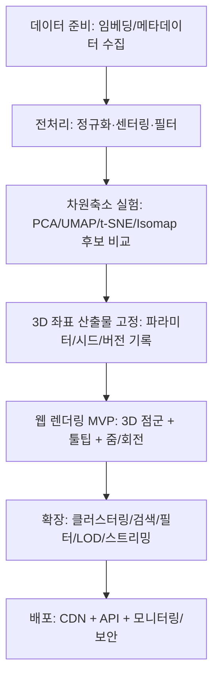

# 리만 기하학과 LLM 임베딩의 연관성 및 3D 인터랙티브 시각화 사전조사

## Executive Summary

이 보고서는 (a) **리만 기하학**이 “임베딩 공간”을 모델링하는 데 어떤 이론적 틀을 제공하는지, (b) **현대 LLM 임베딩(고차원 벡터)**의 생성 방식과 “차원”의 의미를 어떻게 해석할 수 있는지, (c) **고차원→3D 투영(차원축소)** 방법들의 구조 보존 특성·복잡도·하이퍼파라미터를 비교하고, (d) **웹에서 인터랙티브 3D로 대규모 임베딩을 시각화**하기 위한 요구사항과 구현 스택을 사전조사합니다. citeturn0search1turn18search0turn30view1turn20search4

가정(명시): 당신이 임베딩 차원을 지정하지 않으셨으므로 **512/1024**를 대표 예시로 사용하고, 데이터 규모는 **수천~수십만 개 임베딩**을 기본 타깃으로 가정합니다(단, 스택 제안에서는 “수백만”까지 확장 전략도 함께 다룹니다). citeturn30view1turn10search0turn20search17

핵심 결론은 다음과 같습니다.  
첫째, “임베딩 공간의 거리/유사도”를 제대로 정의하려면 결국 **(유클리드든 비유클리드든) ‘계량(metric)’**을 선택해야 하며, 이 계량이 점마다 변할 수 있는 일반 설정이 곧 **리만 계량**(metric tensor)입니다. 따라서 “임베딩을 어떤 공간(유클리드·구면·쌍곡 등)으로 볼 것인가”는 **리만 기하학적 모델 선택 문제**로 정식화됩니다. citeturn26view0turn23view0turn0search0turn12search11

둘째, 현대 임베딩은 대개 **모델 아키텍처의 은닉차원(hidden size)**에 의해 차원이 결정되며(예: BERT는 Base가 768, Large가 1024), 차원 축을 사람이 해석 가능한 “의미 축”으로 가정하는 것은 일반적으로 정당화되기 어렵습니다. 대신 “거리·각도·국소 이웃·곡률(모사)” 등 **기하학적 통계량**으로 구조를 해석하는 접근이 실무적으로 더 안정적입니다. citeturn29view0turn13search2turn4search0turn4search6

셋째, 3D 시각화 목적이라면 PCA/MDS/Isomap 같은 **전역 거리 보존 지향**과 t‑SNE/UMAP/Laplacian Eigenmaps 등 **국소 구조 보존 지향**이 서로 다른 왜곡을 만들며, 특히 t‑SNE는 비볼록 최적화로 초기화·하이퍼파라미터 민감도가 높습니다. 반면 UMAP은 “데이터가 리만 다양체 위에 균일 분포한다” 등 명시적 가정 하에 구성되며, 실무에서 속도·품질 균형이 좋아 대규모 임베딩 시각화에 자주 선택됩니다. citeturn30view1turn8search0turn12search11turn0search2turn7search0

넷째, 웹 3D 인터랙티브 구현은 이미 **Embedding Projector(텐서보드/웹)**가 대표적인 선례를 제공하며, 대규모 점 렌더링은 **WebGL 기반의 deck.gl(OrbitView/PointCloudLayer)** 또는 **three.js(Points/InstancedMesh)**가 성능 측면에서 유리합니다. Plotly는 개발 난이도는 낮지만 브라우저·GPU 메모리·오버드로우 한계가 있어 “수십만~백만” 이상에서 전략적 샘플링/LOD가 필요합니다. citeturn18search0turn9search2turn20search4turn9search3turn10search0

마지막으로, 임베딩은 **원문 복원(embedding inversion)**·**멤버십 추론(membership inference)** 등 보안 위험이 문헌으로 확인되므로, 임베딩도 원문과 유사한 수준의 민감 데이터로 취급하는 설계(접근통제·익명화·보존기간·재현성 설정)가 필요합니다. citeturn13search0turn13search1turn13search8

## 리만 기하학 관점에서 본 임베딩 공간 모델링

### 리만 계량이 “거리”를 정의하는 방식

리만 기하학에서 핵심은, 매 점 \(p\)에서 접공간 \(T_pM\) 위에 **내적**을 부여하는 대칭 양의 정부호 2-텐서 \(g\) (리만 계량)를 두고, 이것으로 곡선 길이와 점 사이 거리를 정의한다는 점입니다. entity["people","John M. Lee","mathematician, riemannian"]의 교재(리만 계량 정의)에서는 “리만 계량은 각 접공간에 내적을 부여하며, 이를 가진 다양체를 리만 다양체라 한다”고 정식화합니다. citeturn26view0

표준적 표기는 다음과 같습니다.

- (리만 계량) \(g_p(\cdot,\cdot): T_pM\times T_pM\to \mathbb{R}\)
- (곡선 길이) \(L(\gamma)=\int_a^b \sqrt{g_{\gamma(t)}(\dot\gamma(t),\dot\gamma(t))}\,dt\)
- (거리) \(d(p,q)=\inf_{\gamma:p\to q} L(\gamma)\)

이 구조는 임베딩에서 “유사도 함수/거리 함수”를 고르는 문제를 **기하학적으로 정교화**합니다. 즉, 단순히 \(\|x-y\|\)를 쓸지, 코사인 기반 각거리(구면), 쌍곡 거리(하이퍼볼릭) 등을 쓸지 선택하는 과정이 “어떤 다양체와 어떤 계량으로 임베딩을 해석할 것인가”로 대응됩니다. citeturn26view0turn13search2

### 유클리드 임베딩과 리만 다양체 임베딩의 차이

유클리드 공간 \(\mathbb{R}^d\)는 계량이 \(g=I\)로 고정된 “곡률 0”의 특수한 리만 다양체입니다. 따라서 대부분의 임베딩 실무(코사인/유클리드 거리 기반 검색)는 사실상 “곡률 0 공간에서 내적/거리로 의미를 측정”하는 셈입니다. citeturn26view0turn13search2

하지만 다음과 같은 이유로 **비유클리드(구면/쌍곡) 또는 ‘국소적으로 유클리드이되 전역으로는 굽은’ 다양체**가 더 적합한 경우가 있습니다.

- 임베딩이 사실상 L2 정규화되어 \(\|x\|=1\) 근처에 모이면, 데이터는 \(\mathbb{R}^d\) 전체가 아니라 **구면 \(S^{d-1}\)** 근처에 놓입니다(구면은 양의 곡률 모델). 이때 코사인 유사도는 각도(내적) 기반이며, 각거리 \(d(x,y)=\arccos(\langle x,y\rangle)\)는 구면의 자연스러운 측지거리(geodesic distance)로 해석됩니다. citeturn4search19turn26view0  
- 개념/계층 구조(트리 유사 구조)를 낮은 차원으로 압축해야 하면, 유클리드는 왜곡이 커질 수 있고, **음의 곡률(쌍곡 공간)**이 계층을 더 효율적으로 표현한다는 연구들이 축적되어 있습니다. 예를 들어 entity["people","Maximilian Nickel","ml researcher, embeddings"]–entity["people","Douwe Kiela","ml researcher, embeddings"]의 *Poincaré Embeddings*는 **쌍곡 공간(포앵카레 볼)**에서 계층을 “더 간결하게” 담을 수 있고, 학습 알고리즘을 **리만 최적화(Riemannian optimization)**로 제시합니다. citeturn0search0  
- 또한 entity["people","Octavian-Eugen Ganea","ml researcher, hyperbolic"]–entity["people","Thomas Hofmann","ml researcher, hyperbolic"] 등은 쌍곡 공간에서의 신경망/부분순서 모델링을 체계화하며, 쌍곡 기하와 리만 기하를 결합해 층/연산을 구성합니다. citeturn2search2turn5search2

image_group{"layout":"carousel","aspect_ratio":"16:9","query":["Poincaré ball model hyperbolic space visualization","geodesic on a sphere diagram arccos dot product distance","Riemannian metric tensor illustration manifold"],"num_per_query":1}

### 쌍곡(하이퍼볼릭) 임베딩에서의 리만 계량과 거리의 예

쌍곡 임베딩이 “리만 기하학을 실제로 쓴다”는 점은 수식으로도 분명합니다. 예컨대 포앵카레 볼 모델 \(D^n=\{x\in \mathbb{R}^n:\|x\|<1\}\)에 대해, 계량이 유클리드 계량에 점별 스케일을 곱한 형태(정확히는 등각(conformal) 형태)로 주어지고, 거리도 그에 따라 비선형입니다. *The Numerical Stability of Hyperbolic Representation Learning*은 이를 다음과 같이 정리합니다. citeturn22view0

- (계량) \(g_x=\lambda_x^2 h_x,\ \lambda_x=\dfrac{2}{1-\|x\|^2}\)  
- (측지거리)  
\[
d_{D^n}(x,y)=\operatorname{arcosh}\!\left(1+\frac{2\|x-y\|^2}{(1-\|x\|^2)(1-\|y\|^2)}\right)
\]

이처럼 “같은 \(\mathbb{R}^n\) 좌표”를 쓰더라도 계량이 점에 따라 달라지므로, 경사하강/업데이트도 유클리드가 아니라 **리만 그래디언트/지수사상(exponential map)** 등(리만 최적화)의 도구를 요구합니다. citeturn22view0turn0search0turn1search3

### 원전 관점: 리만의 ‘선요소(line element)’와 곡률 모델

리만 기하학의 출발점 자체가 “공간의 거리 관계가 (좌표의 미분에 대한) 선요소로 규정될 수 있다”는 관점입니다. entity["people","Bernhard Riemann","mathematician, geometry"]의 강연(entity["people","William Kingdon Clifford","mathematician, translator"] 번역본)에는 일정한 곡률 \(\alpha\) 가정 하에서 선요소 표현을 제시하고(특정 모델에서), 곡률 부호에 따라 구면/평면/음의 곡률 표면을 대비하는 논의가 나타납니다. citeturn24view0  
이 점은 오늘날 “임베딩 공간의 곡률을 무엇으로 둘 것인가(0/+/−)”와 곧바로 연결됩니다. 즉, 곡률을 선택하는 것은 단순한 미학이 아니라 “어떤 구조(계층/군집/순환 등)가 더 낮은 왜곡으로 표현되는가”의 모델 선택입니다. citeturn0search0turn5search0

## LLM 임베딩의 생성 방식과 차원 해석

### 임베딩은 어떻게 만들어지는가

현대 LLM/트랜스포머 계열에서 “임베딩 벡터”는 대체로 다음 중 하나로 생성됩니다.

- **토큰 임베딩(token embeddings)**: 입력 토큰이 모델 내부를 통과하며 얻는 각 토큰의 은닉 상태 벡터.
- **시퀀스/문장 임베딩(sentence/document embeddings)**: [CLS] 토큰 벡터(모델이 이렇게 설계된 경우), 혹은 토큰 벡터들의 평균/가중합(pooling), 혹은 별도의 임베딩 전용 학습(대조학습/시암 네트워크 등)을 통해 얻는 고정 길이 벡터.

이 구조는 트랜스포머가 “온전히 attention으로 구성된 아키텍처”라는 점과 연결되며, 트랜스포머 계열이 대규모 병렬 학습에 적합하다는 배경이 있습니다. citeturn3search4turn3search1turn3search2

특히 BERT 계열은 입력 표현에서 [CLS]의 최종 은닉 상태를 “문장 수준 대표 벡터”로 활용하는 설명이 명시되어 있습니다. citeturn29view0  
또한 문장 임베딩을 목표로 한 Sentence‑BERT는 BERT를 시암/트리플릿 구조로 변형해 “의미적으로 유의미한 문장 임베딩”을 얻는 것을 목표로 합니다. citeturn3search2turn3search6

### “512/1024차원”은 무엇을 의미하는가

임베딩 차원 \(d\)는 보통 “모델의 은닉 차원(hidden size)” 또는 “최종 투영 레이어의 출력 차원”입니다. 즉, **설계/학습으로 결정된 표현 공간의 좌표계 차원**이지, 각 차원이 사람이 자연어로 해석 가능한 독립 의미를 가진다는 보장은 없습니다. citeturn29view0turn31search0

BERT 논문은 모델 크기를 \(L\)(층 수), \(H\)(은닉 크기), \(A\)(헤드 수)로 표기하며, BERT\_BASE는 \(H=768\), BERT\_LARGE는 \(H=1024\)라고 명시합니다. 이는 실무에서 “768/1024/… 차원 임베딩”이 왜 자연스럽게 등장하는지(= 아키텍처 파라미터) 근거가 됩니다. citeturn29view0

따라서 당신이 가정하신 512/1024는 “(1) 비교적 작은/중간 은닉 크기 512”, “(2) BERT‑Large류에서 흔한 1024”처럼, **모델 설계 상의 표현 용량(capacity) 선택**으로 해석하는 것이 가장 안전합니다. citeturn29view0turn31search0

### 선형 구조와 비선형 구조의 해석 가능성

임베딩의 구조를 해석할 때는, 보통 다음 가정을(필요 시) 분리해 두는 것이 엄밀합니다.

- (가정 A: 선형 가정) 의미 관계가 대략 선형 변환/내적 구조로 포착된다. → PCA/선형 프로빙/선형 분류기가 잘 작동할 수 있음.
- (가정 B: 다양체 가정, manifold hypothesis) 데이터가 고차원에서 저차원 다양체 근처에 놓인다. → Isomap/UMAP/Laplacian Eigenmaps 등 “매니폴드 학습”이 유효할 수 있음.

표현학습 리뷰는 표현학습과 매니폴드 학습의 “기하학적 연결”을 명시적으로 논의합니다. entity["people","Yoshua Bengio","ml researcher, deep learning"] 등이 쓴 *Representation Learning: A Review and New Perspectives*는 매니폴드 학습을 포함해 표현학습의 기하학적 연결을 큰 틀에서 다룹니다. citeturn31search0

한편, “실제 임베딩이 얼마나 ‘등방성(isotropic)’인가”는 실무에서 매우 중요합니다. 등방성이 깨지면 거리/각도 기반 해석(특히 코사인 유사도)이 왜곡될 수 있기 때문입니다. entity["people","Kawin Ethayarajh","nlp researcher"]는 BERT/ELMo/GPT‑2 등의 표현이 여러 층에서 등방적이지 않다고 보고합니다. citeturn4search0turn4search4  
또한 “상위 방향 성분을 제거”하는 간단한 후처리로 임베딩 품질을 높인다는 결과도 보고되어(분산이 일부 지배 방향에 몰리는 문제를 시사), 임베딩 공간이 단순 유클리드 “균일한 구름”이라는 가정을 약화시킵니다. citeturn4search1

대조학습 기반 문장 임베딩의 경우, SimCSE는 대조 목적함수가 임베딩의 **비등방성(anisotropy)을 더 균일(uniform)**하게 만들 수 있다는 이론·실험을 포함합니다. 이는 “거리 기반 시각화/클러스터링 이전에 정규화·센터링이 왜 중요한지”를 뒷받침합니다. citeturn4search6

### 임베딩 공간에서의 거리 선택: 유클리드 vs 코사인 vs 리만적 거리

실무 문서(예: entity["company","OpenAI","ai company"]의 임베딩 가이드)도 “임베딩은 부동소수점 벡터이며, 두 벡터 간 거리가 관련성을 측정한다”는 관점을 전면에 둡니다. citeturn13search2  
그러나 어떤 “거리”를 쓸지는 사용자가 결정해야 하며, 다음처럼 기하학이 달라집니다.

- 유클리드 거리: \(\|x-y\|\) (곡률 0 공간)
- 코사인 유사도: \(\dfrac{\langle x,y\rangle}{\|x\|\|y\|}\) (L2 정규화 시 구면에서 각도)
- 하이퍼볼릭 거리: 포앵카레/로렌츠 모델의 측지거리 (음의 곡률) citeturn22view0turn0search0

핵심은, “LLM 임베딩이 본질적으로 리만 다양체 위에 있다”는 강한 명제를 일반적으로 증명할 수는 없지만, (1) 실제 알고리즘(UMAP·하이퍼볼릭 임베딩)이 **리만 기하학을 전제**하거나 사용하고, (2) 실무적으로 코사인/구면 해석, 비등방성 보정, 매니폴드 학습이 널리 쓰이며, (3) 구조 보존을 목표로 한 거리/측지거리 개념이 반복 등장한다는 점에서 “이론적·실무적 연관성”은 상당히 강하게 확인됩니다. citeturn12search11turn0search0turn30view1turn4search0

## 고차원 임베딩의 3D 투영 기법 비교

### 비교의 관점: 무엇을 “보존”하는가

3D 투영은 본질적으로 정보 손실이므로, “무엇을 보존할 것인지”가 설계의 출발점입니다.

- 전역 구조 보존: 큰 스케일의 거리·상대적 배치가 유지되는가?
- 국소 구조 보존: 가까운 이웃 관계가 유지되는가?
- 연속성/안정성: 하이퍼파라미터나 랜덤 시드에 얼마나 민감한가?
- 스케일: \(N\)(샘플 수), \(D\)(원차원), \(d\)(목표차원=3)에서 시간·메모리 요구량

아래 표는 실무에서 자주 쓰이는 방법들을 “3D 시각화”라는 목적에 맞춰 요약합니다(구체 수식/구현은 각 문서/원문 참조). citeturn30view1turn8search0turn12search11turn6search0turn32search0

### 차원축소 기법 비교표

| 기법 | 성격 | 핵심 아이디어/목표 | 주로 보존되는 구조 | 대표 하이퍼파라미터 | 계산/스케일 특성(개략) | 3D 시각화 관점의 주의점 |
|---|---|---|---|---|---|---|
| PCA | 선형 | SVD로 최대 분산 방향 투영 | 전역 분산(선형) | `n_components`, `svd_solver`, (대규모 시) `IncrementalPCA` 배치 크기 | 대규모에서 SVD 비용 큼; IncrementalPCA로 배치 SVD 반복(복잡도 비교 언급) citeturn6search0turn6search19 | 비선형 구조(휘어진 다양체)에서는 “펴지지” 않아 클러스터가 겹칠 수 있음 citeturn30view0 |
| MDS (metric/non-metric) | 비선형(거리 기반) | (비)유사도에 맞게 좌표를 찾아 stress 최소화 | 전역 거리(정의에 따라) | `metric`, `dissimilarity`, `n_init`, `max_iter`, `normalized_stress` | 모든 쌍 거리 필요 시 비용 큼; SMACOF 반복 최적화 citeturn32search0turn32search9 | 대규모 \(N\)에서는 거리행렬 메모리 병목( \(N^2\) ) 가능 citeturn32search0 |
| Isomap | 매니폴드(측지거리) | kNN 그래프에서 최단경로로 측지거리 근사 후 MDS | 전역(측지거리) + 일부 국소 | `n_neighbors`, `path_method`, `eigen_solver` | scikit-learn은 단계별 복잡도(이웃탐색/최단경로/고유분해) 명시 citeturn30view0turn6search2 | kNN 그래프가 끊기면 전역 구조가 붕괴(연결성/노이즈 민감) citeturn30view0 |
| t‑SNE | 매니폴드(확률/국소) | 고차원 유사도→확률, KL divergence 최소화 | 국소 이웃/클러스터 분리 | `perplexity`, `learning_rate`, `early_exaggeration`, `init`, `random_state` | 비볼록; 결과가 초기화에 따라 달라질 수 있음 citeturn30view1turn0search6 | 전역 거리 해석이 위험(클러스터 간 거리/면적은 의미 왜곡 가능) citeturn0search6 |
| UMAP | 매니폴드(리만+위상) | 리만기하·대수위상 기반, 퍼지 단체복합체(fuzzy simplicial set) 정합 | 국소 + 일부 전역(조절 가능) | `n_neighbors`, `min_dist`, `metric`, `n_components`, `random_state` | “리만 다양체 위 균일분포” 등 가정 명시; 실무적으로 확장성 장점이 자주 언급 citeturn12search11turn8search0turn0search1 | 파라미터가 “클러스터링용/시각화용”에서 다르게 권장되기도 함 citeturn8search11 |
| Laplacian Eigenmaps / Spectral Embedding | 스펙트럴(라플라시안) | 그래프 라플라시안≈라플라스-벨트라미로 국소 구조 보존 | 국소(근방 유지) | `n_neighbors`/affinity, `n_components` | 그래프 구성 + 고유분해; “그래프가 다양체의 이산 근사”로 설명 citeturn30view0turn7search0 | 스케일 선택(근방/커널 폭)에 민감, 전역 구조는 약할 수 있음 citeturn7search0 |
| Diffusion Maps | 확산(마코프/스펙트럴) | 확산 과정으로 의미 있는 좌표 구성(마코프 행렬 고유함수) | 다중 스케일/연결 구조 | 커널 폭(ε), 확산 시간(t), 차원 | 확산 기반 좌표를 제안하는 원문 citeturn7search1turn7search5 | 구현/튜닝이 PCA/UMAP보다 복잡할 수 있음(분석 목적에 유리) citeturn7search1 |

### 실무적 권장 조합

- **대규모(수만~수십만) + 3D 시각화**: “PCA로 50차원 내외로 예비 축소 → UMAP 3D” 조합이 자주 안정적입니다. scikit‑learn의 t‑SNE 문서도 고차원일 때 먼저 PCA/TruncatedSVD로 차원을 줄여 계산을 빠르게 하라고 권고합니다. citeturn30view1turn6search0turn6search7turn12search11  
- **계층(트리/온톨로지) 시각화가 핵심**: 처음부터 하이퍼볼릭 임베딩(포앵카레 등)으로 학습하고, 3D는 (i) 하이퍼볼릭 공간 자체의 3D 모델 혹은 (ii) 하이퍼볼릭 거리 기반 추가 축소(h‑MDS 등) 전략을 고려합니다. 하이퍼볼릭 임베딩이 계층 데이터에 유리하다는 근거와 h‑MDS 아이디어는 *Representation Tradeoffs for Hyperbolic Embeddings*에서도 다룹니다. citeturn5search0turn0search0  
- **“클러스터 분리” 탐색이 목표**: t‑SNE/UMAP이 유리하지만, t‑SNE는 파라미터·시드 민감도가 더 크므로 실행 조건(시드·perplexity·학습률)을 고정해 실험 로그를 남기는 편이 재현성에 유리합니다. citeturn30view1turn0search6turn8search0

## 시각화를 위한 데이터 전처리와 시스템 요구사항

### 거리 측정과 정규화

임베딩 시각화 파이프라인에서 “전처리”는 단순한 클린업이 아니라 **기하학을 결정하는 단계**입니다.

- L2 정규화: 코사인 유사도를 쓰는 경우, 정규화는 사실상 “구면 위 각도”로 유사도를 해석하게 만듭니다(구면 측지거리 관점). citeturn4search19turn13search2  
- 센터링/평균 제거: 임베딩이 특정 방향으로 쏠리는(비등방성) 현상이 보고되어 있으며, 평균 제거/상위 성분 제거 등 후처리가 성능을 개선할 수 있습니다. 이는 시각화에서도 “한쪽으로 뭉치는 현상”을 완화하는 데 도움이 될 수 있습니다. citeturn4search0turn4search1  
- 거리(metric) 선택: UMAP/t‑SNE/Isomap 등은 내부적으로 거리나 kNN 그래프를 쓰므로, `metric='cosine'` vs `metric='euclidean'` 선택이 결과를 바꿉니다. UMAP 문서는 `n_neighbors`/`min_dist`가 국소-전역 트레이드오프와 점 응집도를 조절한다고 설명합니다. citeturn8search0turn12search11turn30view1

### 샘플링과 대규모 성능 전략

가정한 규모(수천~수십만)에서는 “전부 렌더링”이 가능할 수도 있지만(스택에 따라), 다음 병목이 흔합니다.

- 차원축소 단계: kNN 그래프/근접탐색이 병목이 되며, UMAP류에서 이 단계가 특히 중요합니다(근사 kNN, NN‑Descent 등). citeturn12search2turn12search11  
- 브라우저 렌더링 단계: 점이 많아질수록 오버드로우/픽킹 비용이 급증합니다. deck.gl 문서는 예로 “점 1천만 + 반지름 5px” 같은 설정이 프래그먼트 셰이더 호출을 폭증시켜 성능을 해칠 수 있음을 경고합니다. citeturn9search2

권장 전략(대규모를 염두에 둔 “전처리/전달/렌더링” 관점):

1) **층화 샘플링/레벨-오브-디테일(LOD)**  
- 전체를 먼저 “클러스터 대표점(centroid/medoid)” 혹은 “샘플”로 렌더링하고, 확대(zoom-in) 시 해당 영역만 원본 점을 로드/표시하는 방식이 브라우저 부하를 줄입니다(이 자체는 설계 전략이며, 구현은 아래 스택 섹션에서 구체화). citeturn9search2turn20search0  

2) **근접탐색/라벨링의 서버사이드화**  
- 호버 시 최근접 이웃 목록(Top‑k)을 즉석 계산하려면 ANN 인덱스가 필요합니다. entity["organization","Faiss","vector similarity search library"]는 대규모 밀집 벡터의 유사도 검색 및 일부 GPU 구현을 제공한다고 문서화합니다. citeturn11search2turn11search5  
- HNSW 계열 구현(예: hnswlib)도 ANN 선택지로 널리 알려져 있습니다. citeturn11search3  

3) **GPU 가속 차원축소(선택)**  
- entity["company","NVIDIA","gpu company"]의 RAPIDS cuML은 GPU 가속 ML 라이브러리이며, UMAP/t‑SNE 같은 매니폴드 기법을 포함합니다. citeturn11search0turn12search1turn11search1  
- cuML UMAP은 더 큰 데이터(특정 조건에서 GPU 메모리 초과 상황 포함)를 위한 배치형 kNN 그래프 구축 등 최근 개선을 소개하기도 합니다. citeturn12search4  

### 인터랙티브 기능 요구사항의 정리

실무적으로 “임베딩 탐색”에 요구되는 상호작용은 이미 Embedding Projector 계열 도구(논문/웹/텐서보드 플러그인)에서 정형화되어 있습니다. citeturn18search0turn18search1turn9search0  
당신이 목표로 하신 기능을 요구사항으로 재정리하면 다음과 같습니다.

- 카메라 인터랙션: 회전/줌/패닝(Orbit 컨트롤) citeturn20search0turn20search4  
- 포인트 탐색: 툴팁(메타데이터), 클릭 선택/고정, 최근접 이웃 강조 citeturn18search0turn11search2  
- 클러스터/필터: 색상(레이블/클러스터), 범위 필터(시간/카테고리), 검색(텍스트/ID) citeturn18search0  
- 애니메이션: 차원축소 “스텝” 애니메이션(선택), 혹은 시간축 데이터의 트래젝토리 citeturn20search20  

## 웹에서의 인터랙티브 3D 구현 스택 제안과 워크플로

### 구현 스택의 선택 기준

웹 3D 임베딩 시각화 스택은 크게 두 축으로 나뉩니다.

- **고수준 차트형(빠른 개발)**: Plotly.js 등  
- **저수준/프레임워크형(성능 최적화)**: deck.gl / three.js(WebGL)  

그리고 UI/상호작용 레이어는 D3.js 같은 라이브러리(HTML/SVG)로 보조할 수 있습니다. citeturn10search11turn20search17turn9search7turn10search2

image_group{"layout":"carousel","aspect_ratio":"16:9","query":["TensorBoard Embedding Projector 3D visualization screenshot","deck.gl OrbitView point cloud visualization","three.js point cloud points instancing demo"],"num_per_query":1}

### 기술 스택 비교표

| 범주 | 옵션 | 강점 | 약점/리스크 | 적합한 규모(경향) | 근거/레퍼런스 |
|---|---|---|---|---|---|
| 프론트 3D | Plotly.js (`scatter3d`) | 구현이 빠르고 대화형 툴팁/줌이 내장된 고수준 API citeturn10search11turn10search4 | 초대형 점에서 브라우저 부하/호환 이슈 가능(특히 WebGL 환경) citeturn10search13turn10search7 | “수만~(환경 좋으면) 수십만/백만”까지 사례 언급 citeturn10search0 | Plotly 성능 가이드(웹GL 트레이스) citeturn10search0 |
| 프론트 3D | deck.gl (OrbitView + PointCloudLayer/ScatterplotLayer) | GPU 기반 대규모 데이터 시각화 프레임워크; OrbitView가 비지리(non‑geospatial) 3D 장면에 적합 citeturn20search4turn20search2turn20search17 | 픽킹/오버드로우 튜닝 필요, 레이어/뷰 개념 학습 필요 citeturn9search2turn20search16 | “수십만~수백만” 이상을 목표로 할 때 유리(프레임워크 지향) citeturn9search10turn20search17 | deck.gl 레이어/성능 문서 citeturn9search2turn20search4 |
| 프론트 3D | three.js (Points/InstancedMesh) | 매우 유연, Instancing으로 draw call 절감 가능 citeturn9search3turn18search3 | 많은 기능을 직접 구현(카메라, picking, UI, LOD 등) | 성능 최적화가 목표일 때(커스텀 엔진 성격) | three.js 문서 citeturn9search3turn18search3 |
| UI/2D | D3.js | 웹 표준 기반의 높은 유연성(툴팁/브러싱/범례/필터 UI) citeturn10search2turn10search9 | 3D 렌더링 엔진이 아니라 보조 레이어 성격 | 모든 규모(보조) | D3 공식 repo/사이트 citeturn10search2turn10search9 |
| 백엔드 API | FastAPI / Flask | Python 기반 데이터/ML 파이프라인과 통합 쉬움; FastAPI는 타입힌트 기반 고성능 API 지향 citeturn19search2turn19search3 | 고부하 스트리밍은 배포/튜닝 필요 | 수만~수십만 전달 + 서버사이드 검색/필터 | 공식 문서 citeturn19search2turn19search3 |
| 백엔드 API | Node.js / Express | JS 생태계와 일관, HTTP 스트리밍/경량 미들웨어 citeturn19search0turn19search1 | Python ML 코드와 분리 시 운영 복잡도 증가 | 프론트 중심 서비스/스트리밍 | 공식 문서 citeturn19search0turn19search1 |
| 차원축소 라이브러리 | scikit‑learn | PCA/Isomap/t‑SNE/MDS 등 폭넓고 안정적 API citeturn6search0turn30view0turn32search0 | 대규모 t‑SNE는 느릴 수 있음(근사 구현 필요) citeturn30view1turn8search12 | 수천~수만(알고리즘별 상이) | scikit docs citeturn30view1turn30view0 |
| 차원축소 라이브러리 | umap‑learn / openTSNE | UMAP 파라미터 가이드·가정 명시, openTSNE는 대규모/개선된 t‑SNE 구현 강조 citeturn12search11turn8search8turn8search12 | 결과 해석 주의(특히 전역 구조), 파라미터 민감 | 수만~수십만(UMAP), 더 큰 규모는 근사/최적화 필요 | 공식 문서/Repo citeturn8search0turn8search12 |
| GPU 옵션 | RAPIDS cuML | GPU 가속 UMAP/t‑SNE 제공 citeturn11search0turn12search1turn11search1 | 환경 구성(CUDA 등) 비용, 일부 기능 제약 | 수십만~(GPU 환경) | cuML docs citeturn11search0turn11search1turn12search1 |

### 권장 워크플로의 “현실적” 청사진

#### 데이터 플로우

1) 임베딩 수집/생성(이미 존재하거나, 별도 모델로 생성)  
2) 전처리(정규화/센터링/필터)  
3) (선택) 예비 축소(PCA 50d)  
4) 3D 차원축소(UMAP 또는 t‑SNE/Isomap 등)  
5) 3D 좌표 + 메타데이터를 브라우저 친화 포맷으로 내보내기  
6) 프론트에서 WebGL로 렌더링 + API로 검색/필터/NN 질의

이 구조는 (a) t‑SNE의 고차원 입력에 대한 PCA 선행 권고, (b) UMAP의 파라미터 특성, (c) Embedding Projector가 강조하는 “상호작용 기반 탐색” 철학과 정합됩니다. citeturn30view1turn8search0turn18search0

#### 간단 예시 코드 스니펫

아래는 “Python(차원축소) → FastAPI(서빙) → deck.gl(3D 렌더)”의 최소 워크플로 예시입니다. (설명 편의를 위한 스니펫이며, 대규모에서는 바이너리 포맷/압축/스트리밍 최적화가 필요합니다.) citeturn19search2turn20search4turn20search2turn12search11

```python
# python: preprocess + (optional) PCA + UMAP-3D, then save to JSON
import json
import numpy as np
from sklearn.decomposition import PCA
from sklearn.preprocessing import normalize
import umap  # umap-learn

def project_embeddings_to_3d(E: np.ndarray, ids: list[str], meta: list[dict],
                            use_pca50: bool = True, random_state: int = 42):
    # 1) L2 normalize for cosine-like geometry (common in embedding use)
    E = normalize(E, norm="l2")

    # 2) Optional: PCA to suppress noise / speed up (recommended for very high-D in some cases)
    if use_pca50 and E.shape[1] > 50:
        E = PCA(n_components=50, random_state=random_state).fit_transform(E)

    # 3) UMAP to 3D
    reducer = umap.UMAP(
        n_neighbors=30,
        min_dist=0.05,
        n_components=3,
        metric="cosine",
        random_state=random_state,
    )
    X3 = reducer.fit_transform(E)

    # 4) Export
    out = []
    for i, p in enumerate(X3):
        out.append({
            "id": ids[i],
            "x": float(p[0]), "y": float(p[1]), "z": float(p[2]),
            "meta": meta[i],
        })
    return out

def save_json(path: str, rows: list[dict]):
    with open(path, "w", encoding="utf-8") as f:
        json.dump(rows, f, ensure_ascii=False)
```

```python
# python: FastAPI minimal serving
from fastapi import FastAPI
from fastapi.responses import JSONResponse
import json

app = FastAPI()
DATA = json.load(open("emb3d.json", "r", encoding="utf-8"))

@app.get("/points")
async def points(limit: int = 200000):
    return JSONResponse(DATA[:limit])  # 실제로는 pagination/streaming 권장
```

```js
// frontend: deck.gl OrbitView + PointCloudLayer (non-geospatial 3D)
import {Deck, OrbitView} from '@deck.gl/core';
import {PointCloudLayer} from '@deck.gl/layers';

async function main() {
  const data = await (await fetch('/points?limit=200000')).json();

  const deck = new Deck({
    parent: document.getElementById('app'),
    views: [new OrbitView()],
    controller: true, // pan/zoom/rotate
    initialViewState: {target: [0, 0, 0], zoom: 0, rotationOrbit: 0, rotationX: 0},
    layers: [
      new PointCloudLayer({
        id: 'embeddings',
        data,
        getPosition: d => [d.x, d.y, d.z],
        getColor: d => [120, 180, 255, 200],
        pointSize: 2,
        pickable: true,
        onHover: info => {
          const el = document.getElementById('tooltip');
          if (info.object) {
            el.style.display = 'block';
            el.textContent = info.object.id;
            el.style.left = `${info.x}px`;
            el.style.top  = `${info.y}px`;
          } else {
            el.style.display = 'none';
          }
        },
      })
    ],
  });
}

main();
```

위 스니펫에서 deck.gl의 OrbitView/컨트롤러/PointCloudLayer는 공식 문서에서 “비지리(non‑geospatial) 3D 장면”과 “점군 렌더링”을 지원한다고 설명됩니다. citeturn20search4turn20search0turn20search2  
또한 deck.gl은 레이어가 “수백만 객체를 효율적으로 처리할 수 있다”는 점을 개발자 가이드에서 언급합니다(다만 오버드로우·픽킹·점 크기 등 실제 튜닝이 필수). citeturn9search10turn9search2

## 데이터·윤리·성능·수치안정성 고려사항

### 프라이버시와 보안: 임베딩도 민감정보일 수 있음

임베딩은 원문을 직접 저장하지 않아도 안전하다고 단정하기 어렵습니다. 문헌상으로는 다음 위험이 구체화되어 있습니다.

- **Generative embedding inversion**: 문장 임베딩에서 원문(또는 의미 있는 민감 단서)을 복원하려는 공격 연구가 보고됩니다. citeturn13search8turn13search0  
- **Membership inference**: 임베딩(또는 임베딩 레이어)을 통해 특정 데이터가 학습에 포함되었는지 추론하는 공격이 연구됩니다. citeturn13search1  

따라서 실무적으로는 임베딩을 “원문과 분리된 안전한 요약”이 아니라, **원문과 동급 또는 준-동급의 민감 자산**으로 취급하는 접근통제/보존정책/로그관리 설계가 보수적이며 합리적입니다. citeturn13search0turn13search1turn13search8

### 재현성: 랜덤성·초기화·버전 고정

- t‑SNE는 scikit‑learn 문서에서 **비볼록 비용함수**로 인해 초기화에 따라 결과가 달라질 수 있음을 명시합니다. citeturn30view1  
- UMAP은 `random_state` 등으로 확률적 동작을 억제할 수 있으나(대가로 성능 손실 가능), 재현성 요구가 있다면 시드/버전/파라미터를 고정하는 운영이 필요합니다(UMAP 생태계에서도 재현성 설정을 별도로 언급). citeturn12search16turn8search4  

실무 권장: (1) 데이터 샘플링 시드, (2) 차원축소 시드, (3) 라이브러리 버전(특히 scikit‑learn/umap‑learn/openTSNE/cuml), (4) 전처리 규칙(정규화/센터링)을 모두 로그로 남기고, 산출물(3D 좌표)을 캐시해 프론트는 “같은 결과를 빠르게 재사용”하도록 하는 것이 안정적입니다. citeturn30view1turn8search0turn8search12

### 수치안정성: 하이퍼볼릭/대규모에서의 함정

쌍곡 공간 임베딩은 경계 근처에서 수치적 문제가 생기기 쉽고, 포앵카레/로렌츠 모델의 안정성 비교 및 표현 범위(경계로의 “밀림”)가 실제 성능에 영향을 줄 수 있음이 논의됩니다. citeturn22view0  
따라서 하이퍼볼릭 임베딩을 실제로 운용한다면 (1) 반지름/클리핑, (2) float32/float64 선택, (3) 리만 최적화의 구현 디테일을 포함한 수치 실험이 필요합니다. citeturn22view0turn0search0

## 구현 로드맵과 우선순위 참고문헌

### 단계별 로드맵, 산출물, 리소스, 시간 추정

아래는 “수천~수십만” 임베딩을 대상으로, 3D 웹 시각화를 제품 수준(MVP→확장)으로 가져가기 위한 로드맵 예시입니다. 시간은 팀/데이터/요구 난이도에 따라 변동되므로 **대략 추정치**로만 제시합니다(정확한 산정은 샘플 데이터로 벤치마크 후 보정이 필요). citeturn9search2turn20search4turn10search0



- 데이터 준비 (0.5~3일)  
  - 산출물: (id, embedding[d], metadata) 스키마 정의, 샘플셋(예: 1만) 확정  
  - 리소스: 저장 포맷(JSONL/Parquet 등), 개인정보 마스킹 정책 수립(필요 시)  
  - 근거: 임베딩 도구가 “임베딩+메타데이터” 형태의 탐색을 전제로 한다는 점(Embedding Projector 류). citeturn18search0turn9search0  

- 차원축소 기법 선정/튜닝 (1~5일)  
  - 산출물: 3D 좌표(방법별), 품질 메모(국소/전역 관찰), 파라미터 세트  
  - 리소스: scikit‑learn/umap‑learn/openTSNE, 대규모 시 cuML 검토 citeturn30view1turn8search0turn11search1turn12search1  

- 웹 시각화 MVP (3~10일)  
  - 산출물: 3D 뷰(회전/줌/패닝), 툴팁, 기본 색상/범례, 데이터 로딩  
  - 리소스(택1): Plotly(빠른 결과) 또는 deck.gl/three.js(확장성) citeturn10search11turn20search4turn9search3  

- 기능 확장(검색/클러스터/LOD) (1~2주)  
  - 산출물: 클러스터 하이라이트, 선택 집합 저장/공유, 샘플링/LOD, 서버사이드 NN 질의  
  - 리소스: ANN(FAISS/HNSW), GPU 옵션(cuML) citeturn11search2turn11search3turn11search0  

- 배포/운영(2~5일)  
  - 산출물: 배포 파이프라인, 캐시/압축, 접근통제, 사용 로그/모니터링  
  - 리소스: FastAPI/Node 스트리밍, 정적 자산 CDN, 보안 점검 citeturn19search2turn19search0turn13search0  

### 우선순위 참고문헌 및 공식 출처 목록

아래 목록은 “당장 확인하면 설계 결정을 빠르게 내릴 수 있는” 순서로 정리했습니다. 가능한 한 원논문/공식 문서를 우선하고, 한국어 자료는 별도 묶음으로 상단에 배치하되(요청 반영), 정확한 구현·수식 근거는 원문/공식 문서를 기준으로 삼는 구성을 권합니다. citeturn0search1turn12search11turn30view1turn18search0

**한국어 참고(보조, 개념 정리/강의 정보 중심)**  
- entity["organization","서울대학교","national university, seoul"] 강의 정보(미분기하학: 리만계량/측지선/곡률 등 커리큘럼 요약). citeturn17search6  
- entity["organization","KAIST","university, daejeon, south korea"] 공개 강의 자료(미분기하학/metric 개념 설명 맥락). citeturn17search2  
- 김강태(POSTECH) 저서/자료 공개 안내(리만기하 관련 도서 목록 및 공개 정책). citeturn15view0turn17search0  

**리만 기하학 원전/정의(이론의 기준점)**  
- entity["people","Bernhard Riemann","mathematician, geometry"] 원문(EMIS 고전문헌) 및 entity["people","William Kingdon Clifford","mathematician, translator"] 번역본(기하의 기반 가설/선요소/곡률 논의). citeturn2search0turn2search1turn24view0  
- entity["people","John M. Lee","mathematician, riemannian"] 교재(리만 계량 정의 및 모델 다양체: 유클리드/구면/쌍곡). citeturn26view0turn25view0  
- entity["people","P.-A. Absil","mathematician, optimization"] 등(리만 최적화/매니폴드 최적화 교재). citeturn1search3  

**임베딩과 표현학습(임베딩의 생성·차원 의미)**  
- 트랜스포머 원 논문(*Attention Is All You Need*). citeturn3search4turn3search12  
- BERT 논문(은닉 차원 \(H=768/1024\), [CLS] 대표 벡터 등). citeturn29view0turn27view0  
- Sentence‑BERT(문장 임베딩 설계). citeturn3search2turn3search6  
- 임베딩 기하(비등방성): Ethayarajh 2019. citeturn4search0  
- 후처리로 등방성 개선(All-but-the-top). citeturn4search1  
- 대조학습 임베딩(SimCSE): 비등방성 완화/정렬-균일성 논의. citeturn4search6  

**차원축소(3D 투영의 핵심 근거)**  
- t‑SNE 원문 및 scikit‑learn 문서(파라미터/비볼록성/권장 전처리). citeturn0search6turn30view1  
- UMAP 원문(리만기하·대수위상 기반) 및 공식 문서(가정/파라미터 가이드). citeturn0search1turn12search11turn8search0  
- Isomap 원문(Science) 및 scikit‑learn의 복잡도 상세. citeturn0search19turn30view0  
- Laplacian Eigenmaps(그래프 라플라시안과 Laplace‑Beltrami 연결). citeturn7search0turn30view0  
- Diffusion maps(확산 기반 좌표). citeturn7search5turn7search1  
- MDS(scikit‑learn MDS 문서 + Kruskal 고전). citeturn32search0turn6search3  

**리만/쌍곡 임베딩(직접적 연관성의 핵심 문헌)**  
- Poincaré Embeddings(리만 최적화 기반 하이퍼볼릭 임베딩). citeturn0search0turn5search3  
- Hyperbolic Neural Networks(쌍곡 공간에서의 신경망 연산 구성). citeturn2search2  
- Representation Tradeoffs for Hyperbolic Embeddings(h‑MDS 포함). citeturn5search0  
- 수치 안정성(포앵카레/로렌츠 모델, 경계 문제). citeturn22view0  

**웹 시각화(레퍼런스 구현과 엔진 선택)**  
- Embedding Projector(도구 개요/논문) 및 TensorBoard 플러그인 문서. citeturn18search0turn18search1turn9search0  
- deck.gl (OrbitView, PointCloudLayer, 성능/인터랙션 가이드). citeturn20search4turn20search2turn9search2turn20search0  
- three.js (Points/InstancedMesh). citeturn18search3turn9search3  
- Plotly 성능 가이드(WebGL로 백만 점 규모 언급). citeturn10search0turn10search4  

**윤리/보안(임베딩 위험에 대한 최신 근거)**  
- Generative embedding inversion(문장 임베딩 정보 누출/복원 위험). citeturn13search8turn13search0  
- Membership inference on embeddings(임베딩 기반 멤버십 추론). citeturn13search1