# SemVer 태그에서 GitHub Release까지: LLM Release Notes와 Astro 홈페이지 자동 반영

## 전체 흐름

```mermaid
flowchart LR
    A["git tag vX.Y.Z"] --> B["GitHub Actions: tag_gate"]
    B --> C["Draft GitHub Release 생성"]
    C --> D["빌드 산출물 업로드"]
    D --> E["GitHub generated notes 생성"]
    E --> F["LLM으로 release notes 정리"]
    F --> G["GitHub Release publish"]
    G --> H["source repo -> homepage repo workflow_dispatch"]
    H --> I["Astro content import + build"]
    I --> J["Cloudflare Pages / Workers 자동 발행"]
```



## 1. 환경

- 프로젝트 저장소( **소스 저장소** )와 홈페이지(블로그) 저장소 모두 GitHub 으로 관리한다.
- 필자는 홈페이지를 Astro 로 만들고, Cloudflare Pages 와 Workers 로 자동 발행했다.
- 소스 저장소는 GitHub Release 를 배포의 기준(source of truth)으로 사용한다.
- 홈페이지 저장소는 GitHub Release 의 내용을 가져와 Astro content 로 변환하고, 페이지에 누적 렌더링한다.
- github 로그인이 되어 있어야 한다.
- 코딩 에이전트와 CLI 사용에 익숙하면 좋다.
- Astro 가 아니라 다른 홈페이지라면 프로젝트 저장소에서 release 정보를 가져와서 홈페이지에 반영하는 스크립트를 작성해야 한다.

### 1-1. 이번 구성에서 필요한 시크릿과 토큰

- `GITHUB_TOKEN`
  - GitHub Actions 가 기본 제공하는 토큰이다.
  - 같은 저장소 안에서 release 생성, 수정, asset 업로드에 사용한다.
- `BLOG_REPO_DISPATCH_TOKEN`
  - 소스 저장소에서 홈페이지 저장소의 `workflow_dispatch` 를 호출할 때 사용하는 fine-grained PAT 이다.
  - 대상 저장소 하나에만 묶고, `Actions: write` 만 주는 것이 핵심이다.(github 에서는 read and write 로 표시됨)
- `OPENAI_API_KEY`
  - LLM 으로 release notes 를 다듬을 때 사용하는 API 키다.
- `OPENAI_MODEL`
  - 사용할 텍스트 생성 모델 이름이다.
  - 모델명은 수시로 바뀔 수 있으므로 secret 이 아니라 repository variable 또는 workflow input 으로 분리하는 편이 운영상 안전하다.

### 1-2. GitHub fine-grained PAT 만드는 방법

`BLOG_REPO_DISPATCH_TOKEN` 은 다음 순서로 만든다.

1. GitHub 우측 상단 프로필 메뉴에서 `Settings` 로 이동한다.
2. 왼쪽 메뉴에서 `Developer settings` 를 연다.
3. `Personal access tokens` -> `Fine-grained tokens` 로 이동한다.
4. `Generate new token` 을 클릭한다.
5. 토큰 이름은 예를 들어 `BLOG_REPO_DISPATCH_TOKEN` 으로 적는다.
6. 만료일은 가능한 짧게 잡는다.
7. `Resource owner` 는 홈페이지 저장소를 소유한 계정 또는 조직으로 선택한다.
8. `Repository access` 는 `Only select repositories` 로 두고 홈페이지 저장소 하나만 선택한다.
9. `Repository permissions` 는 `Actions: Write` (read and write) 만 부여한다.
10. 토큰을 생성한 뒤 값을 복사한다.
11. 소스 저장소의 `Settings` -> `Secrets and variables` -> `Actions` 에서 `New repository secret` 로 `BLOG_REPO_DISPATCH_TOKEN` 을 저장한다.

주의:

- 조직에 approval 정책이 있으면 fine-grained PAT 이 `pending` 상태가 될 수 있다.
- `repository_dispatch` 대신 `workflow_dispatch` 를 사용하면 `Contents: write` 대신 `Actions: write` 만으로 끝낼 수 있어서 권한을 더 좁게 가져갈 수 있다.

### 1-3. OpenAI API Key 만드는 방법

* Release Note 는 GitHub 의 AI 기능으로 생성할 수 있다. 내용을 더 매끈하게 다듬기 위해서 LLM을 이용 하는 방법을 소개하며, 이것은 생략 할 수 있다.

`OPENAI_API_KEY` 는 다음 순서로 만든다.

1. OpenAI Developer Platform 의 API key 페이지로 이동한다.
2. `Create new secret key` 를 선택한다.
3. 키 이름을 지정하고 키를 생성한다.
4. 생성 직후 키 값을 복사한다.
5. GitHub 저장소의 `Settings` -> `Secrets and variables` -> `Actions` 에서 `OPENAI_API_KEY` 로 저장한다.

권장 사항:

- 키는 절대 코드에 하드코딩하지 않는다.
- 필요하면 OpenAI project 단위로 키를 분리한다.
- 실운영에서는 최소 권한, 짧은 수명, 주기적 rotation 을 기본값으로 잡는다.

## 2. GitHub 에서 semantic versioning 을 감지하여 GitHub Release 생성하는 방법

핵심은 `tag_gate` 단계에서 태그를 stable / beta / rc 로 분류하고, release 는 초기에 `draft` 로 만든 다음 빌드 산출물과 notes 가 모두 준비된 뒤 최종 publish 하는 것이다.

이 패턴을 쓰면 다음 장점이 있다.

- `v1.4.7` 같은 stable tag 와 `v1.4.7-beta.1`, `v1.4.7-rc1` 를 명확히 구분할 수 있다.
- build 도중 실패해도 미완성 release 가 바로 publish 되지 않는다.
- 이미 publish 된 tag 는 기본적으로 다시 건드리지 않고, 정말 필요할 때만 `workflow_dispatch` recovery 경로를 연다.

이번 세션의 실제 정규식은 아래와 같은 형태였다.

- stable: `^v[0-9]+\.[0-9]+\.[0-9]+$`
- beta: `^v[0-9]+\.[0-9]+\.[0-9]+-beta(\.[0-9]+)?$`
- rc: `^v[0-9]+\.[0-9]+\.[0-9]+-rc([0-9]+|\.[0-9]+)?$`

* 참고사항

- 아래 예시의 yaml 에서 ${{}} 으로 되어 있는 것은 [github workflow](https://docs.github.com/ko/actions/reference/workflows-and-actions/workflow-syntax) 문법을 사용한 것이다.
- secrets.GITHUB_TOKEN 는 Settings - Secrets and variables - Actions 에서 Secrets 에 변수 설정을 해야 한다는 뜻이다. 

### 2-1. 예제 코드

아래 예시는 강의용으로 핵심만 남긴 release workflow 이다.

```yaml
name: Release

on:
  push:
    tags:
      - "v*"
  workflow_dispatch:
    inputs:
      tag_name:
        description: "Release tag to build and publish"
        required: true
        type: string
      reuse_published_release:
        description: "Allow manual recovery by reusing an already-published release"
        required: false
        default: false
        type: boolean

jobs:
  tag_gate:
    runs-on: ubuntu-latest
    outputs:
      is_release: ${{ steps.check_tag.outputs.is_release }}
      is_prerelease: ${{ steps.check_tag.outputs.is_prerelease }}
    steps:
      - name: Classify release tag
        id: check_tag
        env:
          TAG_NAME: ${{ inputs.tag_name || github.ref_name }}
        run: |
          tag="${TAG_NAME}"
          if [[ "$tag" =~ ^v[0-9]+\.[0-9]+\.[0-9]+$ ]]; then
            echo "is_release=true" >> "$GITHUB_OUTPUT"
            echo "is_prerelease=false" >> "$GITHUB_OUTPUT"
          elif [[ "$tag" =~ ^v[0-9]+\.[0-9]+\.[0-9]+-beta(\.[0-9]+)?$ ]]; then
            echo "is_release=true" >> "$GITHUB_OUTPUT"
            echo "is_prerelease=true" >> "$GITHUB_OUTPUT"
          elif [[ "$tag" =~ ^v[0-9]+\.[0-9]+\.[0-9]+-rc([0-9]+|\.[0-9]+)?$ ]]; then
            echo "is_release=true" >> "$GITHUB_OUTPUT"
            echo "is_prerelease=true" >> "$GITHUB_OUTPUT"
          else
            echo "is_release=false" >> "$GITHUB_OUTPUT"
            echo "is_prerelease=false" >> "$GITHUB_OUTPUT"
          fi

  prepare_release:
    needs: tag_gate
    if: needs.tag_gate.outputs.is_release == 'true'
    runs-on: ubuntu-latest
    permissions:
      contents: write
    steps:
      - name: Ensure draft release exists
        env:
          GH_TOKEN: ${{ secrets.GITHUB_TOKEN }}
          TAG_NAME: ${{ inputs.tag_name || github.ref_name }}
          IS_PRERELEASE: ${{ needs.tag_gate.outputs.is_prerelease }}
        run: |
          set -euo pipefail

          if gh release view "$TAG_NAME" >/dev/null 2>&1; then
            echo "Release already exists: $TAG_NAME"
            exit 1
          fi

          args=(
            --draft
            --verify-tag
            --title "MyApp ${TAG_NAME}"
            --generate-notes
          )

          if [[ "$IS_PRERELEASE" == "true" ]]; then
            args+=(--prerelease)
          fi

          gh release create "$TAG_NAME" "${args[@]}"

  publish_release:
    needs: [tag_gate, prepare_release]
    if: needs.tag_gate.outputs.is_release == 'true'
    runs-on: ubuntu-latest
    permissions:
      contents: write
    steps:
      - name: Publish draft release
        env:
          GH_TOKEN: ${{ secrets.GITHUB_TOKEN }}
          TAG_NAME: ${{ inputs.tag_name || github.ref_name }}
          IS_PRERELEASE: ${{ needs.tag_gate.outputs.is_prerelease }}
        run: |
          if [[ "$IS_PRERELEASE" == "true" ]]; then
            gh release edit "$TAG_NAME" --draft=false --prerelease
          else
            gh release edit "$TAG_NAME" --draft=false
          fi
```

운영 포인트:

- `push.tags: ["v*"]` 로 넓게 받고, 실제 판정은 shell 정규식에서 한다.
- `--generate-notes` 로 GitHub generated notes 를 먼저 만들고, 뒤에서 LLM 이 다듬게 하면 초안 품질이 안정적이다.
- 이미 publish 된 release 를 기본적으로 막아두면 실수로 같은 tag 를 mutate 하는 일을 줄일 수 있다.

### 2-2. 이 단계를 coding agent 를 통해서 수행 할 수 있도록 하는 prompt 예시

프로젝트마다 빌드 산출물과 설정이 다를 수 있어서 위 예시를 그대로 사용 할 수 없는 경우 아래처럼 coding agent 에 요구사항을 전달하면 된다.

```text
macOS 앱 저장소에 GitHub Release 자동화를 추가해줘.

요구사항:
- push tag 와 workflow_dispatch 둘 다 지원할 것
- stable 태그는 vX.Y.Z 형식만 허용
- prerelease 는 beta, rc 태그를 별도로 인식
- release 는 처음에 draft 로 만들고, 빌드/asset 업로드/notes 정리가 끝난 뒤 publish
- 이미 publish 된 tag 는 기본적으로 실패
- 단, workflow_dispatch 에서만 reuse_published_release=true 일 때 recovery 허용
- GitHub generated notes 를 기본 source 로 사용할 것
- 변경 파일은 .github/workflows/release.yml 중심으로 최소 diff 로 구성
- 적용 후 gh workflow lint 수준의 검증과 실제 실행 명령 예시까지 문서화

산출물:
- workflow YAML
- 필요한 secret/variable 목록
- 수동 recovery 실행 방법
- 검증 명령
```

## 3. GitHub 기본 생성 release notes 를 GitHub Release 에 반영하는 단계

세션 구현의 기본 경로는 `GitHub generated notes -> stable publish -> homepage sync` 였다.

즉, 기본값은 다음과 같다.

- GitHub Release 자체가 canonical source 이다.
- release notes 초안은 GitHub 가 기본 제공하는 generated notes 로 만든다.
- 홈페이지나 블로그는 GitHub Release body 를 그대로 재사용한다.

강의에서는 이 기본 경로를 먼저 설명하고, 그 다음에 필요할 때만 `LLM으로 다듬기`를 옵션으로 추가하는 구성으로 한다.

### 3-1. 예제 코드

아래 예시는 GitHub 가 생성한 notes 를 release 에 다시 반영하는 최소 예시다.

```yaml
- name: Regenerate release notes
  env:
    GH_TOKEN: ${{ secrets.GITHUB_TOKEN }}
    GH_REPO: ${{ github.repository }}
    TAG_NAME: ${{ inputs.tag_name || github.ref_name }}
  run: |
    set -euo pipefail

    generated_notes="$(gh api \
      --method POST \
      -H 'Accept: application/vnd.github+json' \
      "repos/${GH_REPO}/releases/generate-notes" \
      -f tag_name="${TAG_NAME}")"

    generated_title="$(jq -r '.name' <<<"$generated_notes")"
    notes_file="$(mktemp)"
    {
      echo "Installer assets, updater metadata, checksums, and attestations are attached below."
      echo
      jq -r '.body' <<<"$generated_notes"
    } > "$notes_file"

    gh release edit "$TAG_NAME" \
      --title "$generated_title" \
      --notes-file "$notes_file"
```

이 방식의 장점:

- GitHub 가 PR, contributor, compare 정보를 기준으로 기본 초안을 안정적으로 만든다.
- release notes 생성을 별도 AI 서비스에 의존하지 않아도 된다.
- release body 가 GitHub 에 저장되므로 이후 홈페이지 sync 도 단순해진다.

### 3-2. 이 단계를 coding agent 를 통해서 수행 할 수 있도록 하는 prompt 예시

```text
기존 GitHub Release workflow 에 GitHub 기본 생성 release notes 단계를 명시적으로 넣어줘.

요구사항:
- gh api repos/{owner}/{repo}/releases/generate-notes 로 notes 초안을 만들 것
- 최종 release title/body 는 gh release edit 로 다시 반영할 것
- 외부 LLM 의존성은 넣지 말 것
- 현재 release workflow 의 draft -> publish 흐름은 유지할 것
- 변경 파일은 .github/workflows/release.yml 중심의 최소 diff 로 구성
- 적용 후 검증 명령과 expected behavior 도 같이 정리
```

### 3-3. 옵션: LLM 으로 generated notes 를 다듬는 방법

이 단계는 선택 사항이다.

언제 쓰면 좋은가:

- GitHub 기본 생성 notes 가 너무 개발자 중심이라 사용자 친화적인 문장으로 다시 쓰고 싶을 때
- 릴리스마다 문체와 섹션 구조를 통일하고 싶을 때
- 한국어/영어 등 다국어 스타일에 맞춰 문장을 다시 정리하고 싶을 때

언제 기본 생성만으로 충분한가:

- 내부 도구이거나 개발자 대상 프로젝트일 때
- 릴리스 속도가 중요하고 추가 API 비용이나 실패 지점을 늘리고 싶지 않을 때
- PR 제목과 라벨 체계가 이미 잘 정리돼 있어 GitHub notes 품질이 충분할 때

운영 원칙:

- GitHub generated notes 를 원문으로 삼고, LLM 은 후처리만 한다.
- LLM 이 새로운 사실을 만들면 안 된다.
- 실패 시에는 기본 generated notes 로 그대로 publish 하거나, publish 전 단계에서 실패로 멈출지 정책을 먼저 정해야 한다.

### 3-4. 예제 코드

아래 Node 스크립트는 dependency 없이 다음 순서로 동작한다.

1. 대상 release 를 조회한다.
2. GitHub generated notes 초안을 만든다.
3. 그 초안을 LLM 으로 다듬는다.
4. 최종 body 를 GitHub Release 에 다시 PATCH 한다.

```js
import fs from "node:fs/promises";
import os from "node:os";
import path from "node:path";

const GITHUB_API = "https://api.github.com";
const OPENAI_API = "https://api.openai.com/v1/responses";
const GITHUB_API_VERSION = "2026-03-10";

function requiredEnv(name) {
  const value = process.env[name]?.trim();
  if (!value) throw new Error(`Missing required environment variable: ${name}`);
  return value;
}

async function gh(pathname, { method = "GET", token, body } = {}) {
  const response = await fetch(`${GITHUB_API}${pathname}`, {
    method,
    headers: {
      Accept: "application/vnd.github+json",
      Authorization: `Bearer ${token}`,
      "X-GitHub-Api-Version": GITHUB_API_VERSION,
      ...(body ? { "Content-Type": "application/json" } : {}),
    },
    body: body ? JSON.stringify(body) : undefined,
  });

  if (!response.ok) {
    throw new Error(`GitHub API failed: ${response.status} ${response.statusText}`);
  }

  return response.json();
}

async function polishWithLlm({ apiKey, model, tagName, generatedTitle, generatedBody }) {
  const prompt = [
    "You are preparing release notes for end users.",
    "Rewrite the input into concise Markdown.",
    "Rules:",
    "- Keep factual accuracy.",
    "- Start with a one-paragraph summary.",
    "- Then use sections: Highlights, Fixes, Notes.",
    "- Do not invent features that are not present.",
    "- Keep version number exactly as given.",
    "",
    `Version: ${tagName}`,
    `Title: ${generatedTitle}`,
    "",
    "Raw release notes:",
    generatedBody,
  ].join("\n");

  const response = await fetch(OPENAI_API, {
    method: "POST",
    headers: {
      "Content-Type": "application/json",
      Authorization: `Bearer ${apiKey}`,
    },
    body: JSON.stringify({
      model,
      input: prompt,
    }),
  });

  if (!response.ok) {
    throw new Error(`OpenAI API failed: ${response.status} ${response.statusText}`);
  }

  const data = await response.json();
  const text = data.output_text?.trim();
  if (!text) {
    throw new Error("LLM returned empty output_text");
  }
  return text;
}

async function main() {
  const repo = requiredEnv("GITHUB_REPOSITORY");
  const tagName = requiredEnv("TAG_NAME");
  const githubToken = requiredEnv("GITHUB_TOKEN");
  const openaiApiKey = requiredEnv("OPENAI_API_KEY");
  const openaiModel = requiredEnv("OPENAI_MODEL");

  const release = await gh(`/repos/${repo}/releases/tags/${encodeURIComponent(tagName)}`, {
    token: githubToken,
  });

  const generated = await gh(`/repos/${repo}/releases/generate-notes`, {
    method: "POST",
    token: githubToken,
    body: { tag_name: tagName },
  });

  const polishedBody = await polishWithLlm({
    apiKey: openaiApiKey,
    model: openaiModel,
    tagName,
    generatedTitle: generated.name || release.name || tagName,
    generatedBody: generated.body || "",
  });

  await gh(`/repos/${repo}/releases/${release.id}`, {
    method: "PATCH",
    token: githubToken,
    body: {
      name: generated.name || release.name || tagName,
      body: polishedBody,
      draft: release.draft,
      prerelease: release.prerelease,
    },
  });

  const previewPath = path.join(os.tmpdir(), `${tagName}-release-notes.md`);
  await fs.writeFile(previewPath, polishedBody, "utf8");
  console.log(`Updated release notes for ${repo}@${tagName}`);
  console.log(`Preview saved at ${previewPath}`);
}

await main();
```

이 스크립트를 workflow 안에서 붙일 때는 다음 step 형태가 가장 단순하다.

```yaml
- name: Polish release notes with LLM
  env:
    GITHUB_TOKEN: ${{ secrets.GITHUB_TOKEN }}
    GITHUB_REPOSITORY: ${{ github.repository }}
    TAG_NAME: ${{ inputs.tag_name || github.ref_name }}
    OPENAI_API_KEY: ${{ secrets.OPENAI_API_KEY }}
    OPENAI_MODEL: ${{ vars.OPENAI_MODEL }}
  run: node scripts/polish-release-notes.mjs
```

실무 팁:

- LLM 에는 raw git diff 전체보다 GitHub generated notes 나 compare summary 를 넣는 편이 토큰 비용과 결과 안정성 모두 유리하다.
- release body 는 최종적으로 GitHub Release 에 저장되므로, 홈페이지/블로그는 이 값을 가져다 재사용하면 된다.
- 프롬프트에는 "추측 금지", "버전명 정확히 유지", "사용자 관점 서술" 같은 제약을 꼭 적는다.

### 3-5. LLM 프롬프트 작성 예시

LLM 으로 다듬을 때는 다음 규칙이 중요하다.

- 입력 원문이 GitHub generated notes 라는 점을 명시한다.
- "새 사실 추가 금지"를 강하게 건다.
- 섹션 구조를 명확히 지정한다.
- 버전명, 링크, PR 번호 같은 식별자를 보존하라고 적는다.
- 너무 마케팅 문구로 흐르지 않게 톤을 지정한다.

예시 프롬프트:

```text
You are rewriting GitHub-generated release notes for end users.

Your task:
- Rewrite the input into concise, factual Markdown release notes.

Rules:
- Do not invent features, fixes, or breaking changes.
- Preserve version numbers, links, PR numbers, and identifiers when present.
- Keep the meaning of the original notes.
- Prefer user-facing language over internal implementation detail.
- If the input does not support a claim, do not add it.
- Output Markdown only.

Required structure:
1. One short summary paragraph
2. ## Highlights
3. ## Fixes
4. ## Notes

Tone:
- Clear and practical
- Not overly promotional
- Suitable for a public product release page

Version: <TAG_NAME>
Title: <TITLE> <TAG_NAME>

Raw GitHub-generated notes:
<PASTE GENERATED NOTES HERE>
```

### 3-6. 이 단계를 coding agent 를 통해서 수행 할 수 있도록 하는 prompt 예시

```text
기존 GitHub Release workflow 에 LLM release note polishing 단계를 추가해줘.

요구사항:
- GitHub generated notes 를 먼저 생성한 뒤, 그 내용을 LLM 으로 다듬어서 release body 로 다시 저장
- 소스 코드는 dependency 없이 Node 내장 fetch 로 작성
- script 파일은 scripts/polish-release-notes.mjs 로 추가
- 필요한 시크릿은 OPENAI_API_KEY, OPENAI_MODEL 로 정리
- LLM 프롬프트에는 다음 제약 포함:
  - 사실 추가 금지
  - Markdown 형식
  - Summary / Highlights / Fixes / Notes 구조
  - 버전 문자열 변경 금지
- 실패 시 release publish 전에 중단되도록 workflow 순서를 배치
- 변경 후 실행 예시와 검증 명령까지 같이 정리
```

### 3-7. release notes 를 홈페이지(블로그) 저장소로 자동 반영

* 자동화가 필요한 이유

- GitHub Release 는 배포 기준이지만, 사용자 입장에서는 홈페이지 제품 페이지에서도 release history 를 바로 봐야 한다.
- 홈페이지 저장소가 앱 저장소와 분리되어 있으므로 cross-repo automation 이 필요하다.
- 이때 소스 저장소가 홈페이지 저장소 파일을 직접 쓰지 않고, homepage repo 의 workflow 를 깨워서 그 저장소가 자기 파일을 직접 커밋하게 만드는 구조가 안전하다.

#### source repo 에서 homepage repo 를 깨우는 workflow 예시

```yaml
name: Dispatch studiojin-home release notes

on:
  release:
    types:
      - published
  workflow_dispatch:
    inputs:
      tag_name:
        description: "Published stable release tag to sync"
        required: true
        type: string

jobs:
  dispatch_release_notes:
    if: github.event_name != 'release' || github.event.release.prerelease == false
    runs-on: ubuntu-latest
    permissions:
      contents: read
    steps:
      - name: Resolve published stable release tag
        id: resolve_tag
        env:
          EVENT_NAME: ${{ github.event_name }}
          GH_TOKEN: ${{ secrets.GITHUB_TOKEN }}
          GH_REPO: ${{ github.repository }}
          INPUT_TAG_NAME: ${{ inputs.tag_name }}
          RELEASE_TAG_NAME: ${{ github.event.release.tag_name }}
        run: |
          set -euo pipefail

          if [[ "$EVENT_NAME" == "release" ]]; then
            echo "tag_name=${RELEASE_TAG_NAME}" >> "$GITHUB_OUTPUT"
            exit 0
          fi

          tag="${INPUT_TAG_NAME}"
          release_json="$(curl -fsSL \
            -H 'Accept: application/vnd.github+json' \
            -H "Authorization: Bearer ${GH_TOKEN}" \
            -H 'X-GitHub-Api-Version: 2026-03-10' \
            "https://api.github.com/repos/${GH_REPO}/releases/tags/${tag}")"

          draft="$(jq -r '.draft' <<<"$release_json")"
          prerelease="$(jq -r '.prerelease' <<<"$release_json")"
          published_at="$(jq -r '.published_at' <<<"$release_json")"

          if [[ "$draft" != "false" || "$prerelease" != "false" || "$published_at" == "null" ]]; then
            echo "Manual sync only supports published stable releases" >&2
            exit 1
          fi

          echo "tag_name=${tag}" >> "$GITHUB_OUTPUT"

      - name: Dispatch homepage workflow
        env:
          BLOG_REPO_DISPATCH_TOKEN: ${{ secrets.BLOG_REPO_DISPATCH_TOKEN }}
          TAG_NAME: ${{ steps.resolve_tag.outputs.tag_name }}
        run: |
          curl -fsSL \
            -X POST \
            -H 'Accept: application/vnd.github+json' \
            -H "Authorization: Bearer ${BLOG_REPO_DISPATCH_TOKEN}" \
            -H 'X-GitHub-Api-Version: 2026-03-10' \
            "https://api.github.com/repos/kimjj81/studiojin-home/actions/workflows/import-syncwatcher-release-notes.yml/dispatches" \
            -d @- <<EOF
          {"ref":"main","inputs":{"source_repo":"studiojin-dev/SyncWatcher","tag_name":"${TAG_NAME}"}}
          EOF
```

#### homepage repo 에서 release notes 를 가져와 Astro content 로 저장하는 workflow 예시

```yaml
name: Import SyncWatcher release notes

on:
  workflow_dispatch:
    inputs:
      source_repo:
        description: "Source repository slug"
        required: true
        type: string
      tag_name:
        description: "Published stable release tag"
        required: true
        type: string

jobs:
  import_release_notes:
    runs-on: ubuntu-latest
    permissions:
      contents: write
    steps:
      - name: Checkout main
        uses: actions/checkout@v5
        with:
          ref: main

      - name: Setup Node.js
        uses: actions/setup-node@v6
        with:
          node-version: 22.12.0
          cache: npm

      - name: Import release notes
        env:
          SOURCE_REPO: ${{ inputs.source_repo }}
          TAG_NAME: ${{ inputs.tag_name }}
        run: node scripts/import-syncwatcher-release-notes.mjs

      - name: Install dependencies
        run: npm ci

      - name: Build site
        run: npm run build

      - name: Commit imported release notes
        env:
          TAG_NAME: ${{ inputs.tag_name }}
        run: |
          set -euo pipefail
          if [[ -z "$(git status --short -- src/content/syncwatcher-release-notes)" ]]; then
            echo "No release note changes to commit."
            exit 0
          fi
          git config user.name "github-actions[bot]"
          git config user.email "41898282+github-actions[bot]@users.noreply.github.com"
          git add src/content/syncwatcher-release-notes
          git commit -m "chore: import SyncWatcher release notes for ${TAG_NAME}"
          git push origin HEAD:main
```

#### homepage repo import 스크립트 예시

- 아래 예제는 참고 사항이므로 OUTPUT_DIR 는 본인 상황에 맞게 수정해야 한다.

```js
import fs from "node:fs/promises";
import path from "node:path";

const OUTPUT_DIR = path.join(process.cwd(), "src/content/product-release-notes"); // product-release-notes 를 본인 제품명에 해당하는 것으로 수정.

function requiredEnv(name) {
  const value = process.env[name]?.trim();
  if (!value) throw new Error(`Missing required environment variable: ${name}`);
  return value;
}

function yamlString(value) {
  return JSON.stringify(String(value));
}

async function fetchRelease(sourceRepo, tagName) {
  const response = await fetch(
    `https://api.github.com/repos/${sourceRepo}/releases/tags/${encodeURIComponent(tagName)}`,
    {
      headers: {
        Accept: "application/vnd.github+json",
        "X-GitHub-Api-Version": "2026-03-10",
      },
    },
  );

  if (!response.ok) {
    throw new Error(`GitHub release lookup failed for ${sourceRepo}@${tagName}`);
  }

  return response.json();
}

async function main() {
  const sourceRepo = requiredEnv("SOURCE_REPO");
  const tagName = requiredEnv("TAG_NAME");
  const release = await fetchRelease(sourceRepo, tagName);

  if (release.draft || release.prerelease || !release.published_at) {
    throw new Error("Only published stable releases can be imported.");
  }

  await fs.mkdir(OUTPUT_DIR, { recursive: true });

  const markdown = [
    "---",
    `title: ${yamlString(release.name || release.tag_name)}`,
    `tag: ${yamlString(release.tag_name)}`,
    `publishedAt: ${yamlString(release.published_at)}`,
    `releaseUrl: ${yamlString(release.html_url)}`,
    "---",
    "",
    (release.body || "").trim() || "_No release notes were provided for this release._",
    "",
  ].join("\n");

  await fs.writeFile(path.join(OUTPUT_DIR, `${release.tag_name}.md`), markdown, "utf8");
}

await main();
```

운영 포인트:

- source repo 는 homepage repo 파일을 직접 수정하지 않는다.
- homepage repo 가 자기 content 를 생성하고, 자기 `GITHUB_TOKEN` 으로 커밋한다.
- manual replay 는 `published stable release` 만 허용해야 운영 실수가 줄어든다.
- `workflow_dispatch` 로 받는 workflow 파일은 대상 저장소의 default branch 에 있어야 정상 수신된다.

## 4. 검증하는 방법

이 파이프라인은 적어도 다음 네 층위로 검증하는 것이 좋다.

1. release workflow 가 SemVer 태그를 올바르게 분류하는지 확인한다.
2. GitHub Release 가 draft -> notes 반영 -> publish 순서로 끝나는지 확인한다.
3. stable publish 뒤 homepage repo 의 import workflow 가 실제로 실행되는지 확인한다.
4. Astro build 와 실제 제품 페이지 렌더링까지 확인한다.

권장 검증 순서 예시:

```bash
# 1) 새 stable tag 로 릴리스 발행
git tag v1.4.8
git push origin v1.4.8

# 2) source repo release workflow 모니터링
gh run list --workflow Release --limit 5
gh run watch <SOURCE_RUN_ID>

# 3) release 상태 확인
gh release view v1.4.8 --repo org-name/repo-name

# 4) 필요하면 manual replay
gh workflow run "Dispatch release notes" \
  --repo org-name/repo-name \
  -f tag_name=v1.4.8

# 5) homepage workflow 모니터링
gh run list --workflow "Import release notes" --repo org-name/homepage-repo-name --limit 5
gh run watch <HOMEPAGE_RUN_ID> --repo org-name/homepage-repo-name
```

검증 체크리스트:

- source release 가 `draft=false` 로 publish 되었는가
- release body 에 GitHub generated notes 또는 선택적으로 LLM 이 다듬은 notes 가 들어갔는가
- prerelease 가 아닌 stable tag 만 homepage import 를 호출했는가
- homepage repo 에 `src/content/product-release-notes/<tag>.md` 가 생성되었는가
- homepage build 가 성공했는가
- 제품 페이지에 최신 release 가 맨 위에 보이는가
- import script 를 다시 실행했을 때 변경이 없으면 no-op 인가

### 4-1. llm 을 통해서 첫번째 발행하고, 검증할 수 있게 하는 prompt 예시

```text
이 저장소에 첫 stable release 를 발행하고 end-to-end 검증까지 해줘.

요구사항:
- stable 태그는 vX.Y.Z 형식으로 하나 선택하거나 새로 만든다
- GitHub Release 는 draft -> asset 업로드 -> release notes 반영 -> publish 순서로 끝나야 한다
- 기본 경로는 GitHub generated notes 를 사용하고, LLM polishing 이 있으면 그 단계도 같이 검증할 것
- publish 후 homepage repo workflow_dispatch 가 자동으로 실행되어야 한다
- homepage repo 는 Astro build 까지 성공해야 한다
- 검증은 다음까지 포함:
  - source workflow run URL
  - homepage workflow run URL
  - gh release view 결과 요약
  - import 된 markdown 파일 경로
  - no-op 재실행 확인 여부
- 실패하면 중간에서 멈추지 말고 원인과 수정 사항까지 정리
- 최종 보고는 "무엇을 실행했고 무엇이 검증됐는지" 중심으로 간단히 정리
```

## 마무리

이번에는 프로덕트 릴리스 후 자동으로 홈페이지에 릴리스 노트를 발행하는 파이프라인을 구축했다.  
릴리즈 노트 자동 발행을 통해서 운영에 도움이 되길 바란다.

문의 사항이 있다면 언제나 편하게 연락주세요. support@studiojin.dev

## 참고 문서

- GitHub Actions workflow trigger 문서: [Triggering a workflow](https://docs.github.com/en/enterprise-cloud@latest/actions/how-tos/write-workflows/choose-when-workflows-run/trigger-a-workflow)
- GitHub Releases REST API: [REST API endpoints for releases](https://docs.github.com/en/rest/releases/releases?apiVersion=2022-11-28)
- GitHub workflow dispatch REST API: [REST API endpoints for workflows](https://docs.github.com/en/enterprise-cloud@latest/rest/actions/workflows)
- GitHub repository dispatch REST API: [REST API endpoints for repositories](https://docs.github.com/en/enterprise-cloud@latest/rest/repos/repos?apiVersion=2026-03-10)
- GitHub PAT 관리: [Managing your personal access tokens](https://docs.github.com/en/authentication/keeping-your-account-and-data-secure/managing-your-personal-access-tokens)
- OpenAI API 인증: [OpenAI API Reference - Authentication](https://platform.openai.com/docs/api-reference/introduction/api-keys)
- OpenAI API 키 생성 도움말: [Where do I find my OpenAI API Key?](https://help.openai.com/en/articles/4936850-where-do-i-find-my-api-key)
