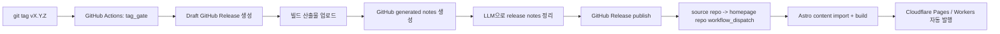

# release pipeline map

```mermaid
flowchart LR
    A["git tag vX.Y.Z"] --> B["GitHub Actions: tag_gate"]
    B --> C["Draft GitHub Release 생성"]
    C --> D["빌드 산출물 업로드"]
    D --> E["GitHub generated notes 생성"]
    E --> F["LLM으로 release notes 정리"]
    F --> G["GitHub Release publish"]
    G --> H["source repo -> homepage repo workflow_dispatch"]
    H --> I["Astro content import + build"]
    I --> J["Cloudflare Pages / Workers 자동 발행"]
```

## 읽는 포인트

- GitHub Release가 기준 저장소인지
- homepage repo가 소비자 역할만 하는지
- publish 이전과 이후의 책임이 분리되어 있는지
