# release pipeline map

```mermaid
flowchart LR
    A["git tag vX.Y.Z"] --> B["GitHub Actions: tag_gate"]
    B --> C["Create draft GitHub Release"]
    C --> D["Upload build artifacts"]
    D --> E["Generate GitHub release notes"]
    E --> F["Optionally polish notes with an LLM"]
    F --> G["Publish GitHub Release"]
    G --> H["Dispatch homepage workflow"]
    H --> I["Import into Astro content + run build"]
    I --> J["Deploy through Cloudflare Pages / Workers"]
```

## What to look for

- Whether GitHub Release is the canonical source
- Whether the homepage repo stays a consumer instead of a second editor
- Whether the responsibilities before and after publish remain clearly split
